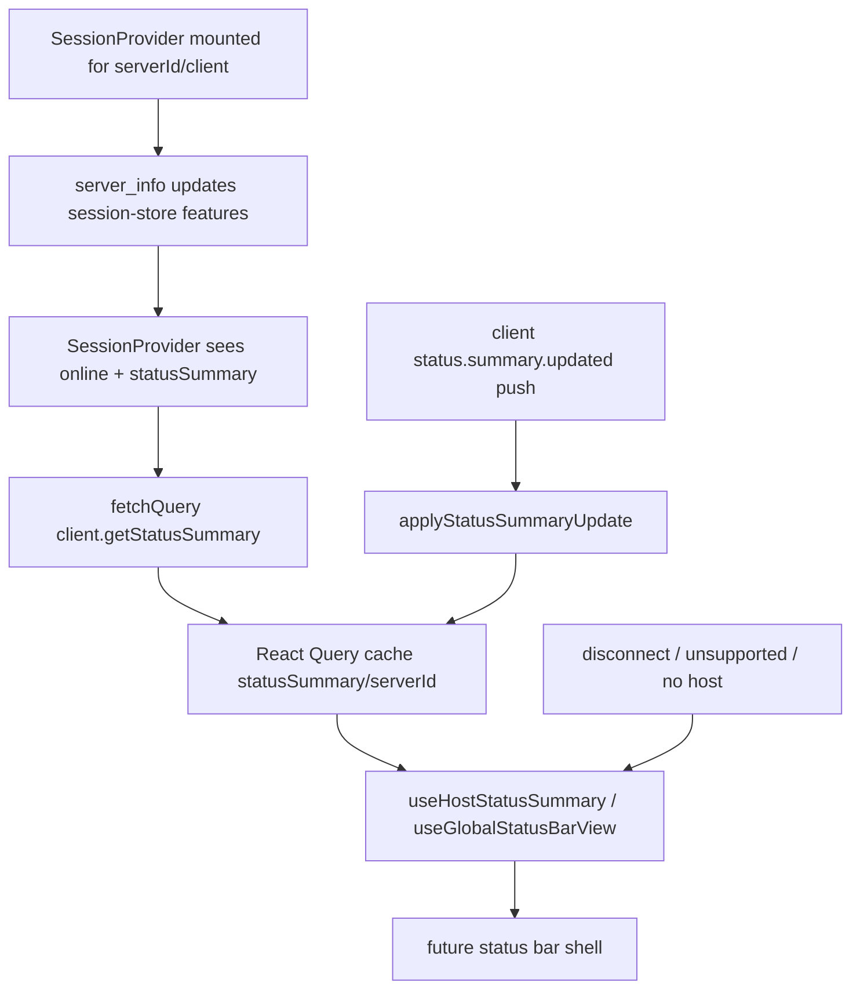

# app-status-summary-store feature design

## 0. 术语约定

| 术语                            | 定义                                                                                                   | 防冲突结论                                                                   |
| ------------------------------- | ------------------------------------------------------------------------------------------------------ | ---------------------------------------------------------------------------- |
| Status Summary Cache            | app 内按 `serverId` 缓存 `HostStatusSummaryPayload`、loading/error/stale 状态的 host 级 server state。 | 新模块，落在 `packages/app/src/status-summary/`，不塞进 `session-store.ts`。 |
| Status Summary View Model       | 给后续底部 status bar 消费的纯派生对象，包含 capability/connection/error/ready 等状态和首屏 row 数据。 | 本 feature 只产出数据模型与 hook，不渲染 UI。                                |
| `statusSummary` capability gate | `server_info.features.statusSummary === true`。                                                        | 唯一新 daemon gate；旧 daemon 不 fan out 到旧 RPC。                          |
| Summary refresh                 | 连接在线且 gate 支持时调用 `client.getStatusSummary()` 获取权威快照。                                  | 初连、重连、app resume 后执行；push 只做即时更新。                           |

## 1. 决策与约束

### 需求摘要

本 feature 完成全局状态栏数据闭环的 app 侧接入：在 `status-summary-protocol` 已提供 client SDK 与 push message 后，app 能按 host 维护 summary cache，集中处理 capability gate、连接状态、初始 fetch、push 更新、重连 refresh 和后续 UI 可直接消费的 view model。

成功标准：

- host 支持 `statusSummary` 且在线时，app 能调用 `client.getStatusSummary()` 填充 per-host cache。
- 收到 `status.summary.updated` push 时，cache 被同 serverId 的完整 snapshot 替换。
- 断线、旧 daemon、请求失败、无数据状态有明确 view model，不在 UI 组件里散落判断。
- 后续 status bar shell 可通过 hook 读取 `{kind, summary, primaryRows, runningAgents}`，无需直接碰 daemon client 或旧 RPC。

明确不做：

- 不渲染底部状态栏、不改 `packages/app/src/app/h/[serverId]/_layout.tsx`、不做导航动作。
- 不实现 provider plan usage fetch；只暴露可选入口状态，不调用 `provider.usage.list.request`。
- 不从 `agent_update` / session store / timeline 拼旧 daemon fallback。
- 不持久化 summary cache 到 AsyncStorage；summary 是连接期 server state。
- 不改 daemon protocol/server/client SDK；这些属于前置 `status-summary-protocol`。

### 复杂度档位

- `Compatibility = feature-gated`：只在 `statusSummary` capability 为 true 时调用新 RPC；旧 daemon view model 为 `unsupported`。
- `State = host-scoped server state`：按 `serverId` 隔离，切换 workspace/agent tab 不丢；全局无 host 路由是否展示由后续 shell 决定。
- `Performance = narrow subscription`：hook 用 selector / query key，避免每个 `agent_update` 触发 status bar 重新拼装。
- `Idempotency = replace snapshot`：get/push 都是完整 summary，cache 直接替换，不做 patch merge。

### 关键决策

1. **新建 `packages/app/src/status-summary/` app 模块**
   - summary cache、query key、push apply、view model 纯函数集中在该目录。
   - `session-store.ts` 已承担 agent/workspace/timeline，不继续扩张。

2. **React Query 承载 cache，SessionProvider 负责常驻 refresh 与 push**
   - 现有 `provider-usage` / `providers-snapshot` 已用 React Query 表达 host server state。
   - 初始 fetch、重连 refresh、app resume refresh 由 `SessionProvider` 通过命令式 `queryClient.fetchQuery` / `prefetchQuery` 触发，避免 status bar shell 未挂载时 query inactive 导致 refresh 变成 no-op。
   - hook 仍使用 React Query 订阅 cache，并可在 UI 挂载但 cache 缺失时兜底 fetch；push 用 `queryClient.setQueryData` 写入同一 query key。
   - status summary freshness 来自 push 与命令式 refresh，不来自 time-based stale；query `staleTime` 固定为 `Infinity`，重连/resume 显式 refetch。

3. **feature gate 单点在 hook/query enable 条件**
   - gate 来源复用 `useHostFeature(serverId, "statusSummary")` / session store 的 `serverInfo.features`。
   - 不在 view model 下游写多处旧 daemon防御；下游只看 `kind: "unsupported"`。

4. **view model 第一版只做数据可消费，不做视觉布局**
   - 输出 primary rows：lifetime/today tokens、cost、running/attention/error counts。
   - 输出 running agent snapshot 列表，供后续 nav feature 使用；本 feature 不做 press handler。

### Roadmap §4.4 契约 reconciliation

roadmap §4.4 的 `GlobalStatusBarView` 是早期 UI-facing 示例；本 feature 把它拆成 app data/view model 与后续 shell/nav 两层：

- hook 命名对齐 roadmap：导出 `useHostStatusSummary(serverId)` 和 `useGlobalStatusBarView(serverId)`；内部文件名可保持 `use-status-summary.ts`。
- `unsupported` 在本 feature 作为顶层 view kind 表达，因为它不是 hidden 的 route 状态，而是 host capability 状态；后续 shell 可决定是否把它渲染为隐藏或升级提示。
- `offline` 是本 feature 新增的 host connection 状态，避免把离线误报成 loading/error。
- `focus-mode` 由 `global-status-bar-shell` 根据 shell layout/focus mode 决定；app store 不读取 route/shell focus state。
- `StatusBarRow.target` 与导航动作归 `status-bar-running-sessions-nav`；本 feature 只提供 `runningAgents` / `needsAttentionAgents` / `recentlyCompletedAgents` snapshot 列表。
- `StatusBarRow.kind` 的 UI 分类可在 shell feature 从本 feature 的稳定 `id` 派生；本 feature 用固定 `id` 保障 rows 可测试。

### Top 3 风险与缓解

1. **连接生命周期重复订阅或过期 push 写错 host**
   - 缓解：push apply 必须在 `SessionProvider` 当前 `serverId/client` effect 内注册并清理；query key 带 serverId；测试覆盖 client 切换后旧 subscription 不写新 host。
2. **旧 daemon fallback 散落到 UI**
   - 缓解：hook 的 `enabled` 只在 `statusSummary` true 时打开；view model 显式 `unsupported`；反向 grep 不允许调用 `fetchAgents` / `agent_list` 拼 summary。
3. **React Query 与 push 状态语义不清**
   - 缓解：get response 是权威值，push 是即时完整 snapshot；push 到达时设置 query data 并清掉错误；重连/app resume 仍 refetch。

### 非显然依赖与关键假设

- 依赖 `status-summary-protocol` 提供 `DaemonClient.getStatusSummary()` 和 typed `client.on("status.summary.updated")`。
- 假设 `SessionProvider` 在每个 online host client 上已挂载，并且能访问 singleton `queryClient`。
- 假设 `status.summary.updated` payload 是完整 snapshot；若 protocol 改成 patch，本 feature 需回设计。
- `HostStatusSummaryPayload` 的字段命名以前置 protocol design 为准，app 不重复定义并行协议类型。

## 2. 名词与编排

### 2.1 名词层

#### 现状

- `packages/app/src/runtime/host-features.ts` 已提供 `hostSupportsFeature`、`selectHostFeature`、`useHostFeature`，从 `session-store` 的 `serverInfo.features` 读取 host capability。
- `packages/app/src/provider-usage/use-provider-usage.ts` 用 React Query + `useHostRuntimeClient` + `useHostRuntimeIsConnected` + feature gate 管理 provider usage server state。
- `packages/app/src/hooks/use-providers-snapshot.ts` 在 `client.on("providers_snapshot_update")` push 到达时用 `queryClient.setQueryData` 更新 query cache。
- `packages/app/src/contexts/session-context.tsx` 是每个 host client 的 message handler 集中点，已经注册 `agent_update`、`agent_stream`、`status` 等 push，并在 cleanup 里 unsubscribe。
- `packages/app/src/stores/session-store.ts` 保存 serverInfo、agent/workspace/timeline 等长期 session state，文件职责和体量都已偏大。

#### 变化

新增 app 模块：

```ts
type StatusSummaryQueryState =
  | { kind: "disabled"; reason: "no-host" | "offline" | "unsupported" }
  | { kind: "loading"; previousSummary?: HostStatusSummaryPayload }
  | { kind: "error"; message: string; previousSummary?: HostStatusSummaryPayload }
  | { kind: "ready"; summary: HostStatusSummaryPayload; isRefreshing: boolean };

type StatusSummaryViewModel =
  | { kind: "hidden"; reason: "no-host" }
  | { kind: "offline" | "unsupported" | "loading" | "error"; message?: string }
  | {
      kind: "ready";
      summary: HostStatusSummaryPayload;
      primaryRows: StatusBarRow[];
      runningAgents: StatusAgentSnapshot[];
      needsAttentionAgents: StatusAgentSnapshot[];
      recentlyCompletedAgents: StatusAgentSnapshot[];
      generatedAt: string;
      isRefreshing: boolean;
    };

type StatusBarRow = {
  id: "lifetime-tokens" | "today-tokens" | "cost" | "running" | "attention" | "errors";
  label: string;
  value: string;
  tone: "default" | "ok" | "warning" | "danger";
};
```

命名与来源：

- `HostStatusSummaryPayload`、`StatusAgentSnapshot` 从 `@getpaseo/protocol/messages` 或 client SDK 导出类型复用；app 不手写并行 wire type。
- query key：`["statusSummary", serverId]`，serverId 为空时不 fetch。
- query freshness：`staleTime: Infinity`；只有 explicit refresh、initial missing data fetch 或 push 会更新 cache。
- `applyStatusSummaryUpdate({ serverId, queryClient, message })` 只接受 `status.summary.updated`，并写入当前 serverId 的 query cache。
- `buildStatusSummaryViewModel(input)` 是纯函数，格式化 total/today/cost/counts，供 hook 和单测复用。

### 2.2 编排层



#### 现状

- root `_layout.tsx` 为每个在线 host client 挂 `SessionProvider`；host pages 在 `h/[serverId]/*` 下由 host layout 管理。
- `useHostRuntimeClient(serverId)` 和 `useHostRuntimeIsConnected(serverId)` 已提供连接状态。
- app 有 singleton `queryClient`，`SessionProvider` 通过 `useQueryClient()` 可写 cache。
- provider usage query 5 分钟 stale，但 status summary 是实时状态，不应沿用 provider quota stale 策略。

#### 变化

- `packages/app/src/status-summary/query.ts`：定义 query key、fetcher、`useHostStatusSummary`、`refreshStatusSummary` / `prefetchStatusSummary` 辅助。
- `packages/app/src/status-summary/push.ts`：定义 `applyStatusSummaryUpdate`，供 `SessionProvider` push handler 调用。
- `packages/app/src/status-summary/view-model.ts`：纯函数构建 `StatusSummaryViewModel` 和 rows。
- `packages/app/src/status-summary/use-status-summary.ts`：组合 host client、connection、feature gate、query、view model，输出 `useGlobalStatusBarView(serverId)`。
- `packages/app/src/contexts/session-context.tsx`：在 message handler effect 中订阅 `status.summary.updated`，cleanup 时 unsubscribe；初连、连接恢复和 app resume 时命令式 `fetchQuery` / `prefetchQuery` status summary。

#### 流程级约束

- Fetch enable：`Boolean(serverId && client && isConnected && supportsStatusSummary)`；SessionProvider 的命令式 refresh 与 hook 的兜底 query 使用同一 predicate。
- 旧 daemon：`supportsStatusSummary !== true` 时不调用 `getStatusSummary`，view model 为 `unsupported`。
- Offline：断线时不清空上一次 summary query data；view model 可带 previous summary，但 `kind` 必须表达 offline，避免误导为实时。
- Push：push 是完整 snapshot，直接 replace query data；不 merge arrays、不按 timestamp 局部 patch。
- Push after error：若最近一次 get 失败后收到 push snapshot，view model 必须回到 `ready` 或至少以最新 summary 为主；实现不能让旧 query error 遮住更新后的 data。
- Reconnect/app resume：现有 `SessionProvider` 连接恢复 revalidation 流程旁同步 `fetchQuery` / `prefetchQuery` status summary；不能只依赖 push，也不能只 `invalidateQueries` 依赖 active observers。
- Error：get 失败时保留 previous summary 供 UI 降级显示，同时 view model 为 `error`。
- Provider usage：本模块不得调用 `listProviderUsage` / `provider.usage.list`；后续 UI 只链接已有 provider usage 入口。

### 2.3 挂载点清单

- `packages/app/src/status-summary/`：新增 query、push、view model、hook 模块。
- `packages/app/src/contexts/session-context.tsx`：注册 `status.summary.updated` push handler，并在连接恢复/app resume 时触发 summary refetch。
- `packages/app/src/runtime/host-features.ts`：若 `HostFeatureName` 类型能自动包含 `statusSummary` 则不改；若编译需要，补单点类型支持。
- `packages/app/src/status-summary/*.test.ts`：新增 view model/query/push 目标测试。

### 2.4 推进策略

1. Query/cache 骨架：定义 query key、fetcher、`staleTime: Infinity`、enabled 条件、`refreshStatusSummary` 辅助和 hook 返回的 query state。
   退出信号：单测覆盖 supported/unsupported/offline/no-host 不同 enable 结果；unsupported 不调用 client；explicit refresh 不依赖 active observer。
2. Push apply：实现 `applyStatusSummaryUpdate` 并接入 `SessionProvider` message effect。
   退出信号：测试覆盖 push replace cache、不同 serverId 隔离、cleanup 后旧 client 不再写 cache。
3. Reconnect refresh：连接从 offline→online、app resume 或 SessionProvider revalidation 时命令式 `fetchQuery` / `prefetchQuery` status summary。
   退出信号：SessionProvider 目标测试证明无 UI observer 时重连仍触发 fetch，且 unsupported host 不触发。
4. View model：实现 rows、running/attention/recent lists、loading/error/offline/unsupported 状态。
   退出信号：纯函数单测覆盖 token/cost/counts、空 totals、previous summary、错误态。
5. 范围守护与验证：运行目标 app tests、typecheck、lint、format check。
   退出信号：命令输出或环境阻塞记录齐全，grep 证明未调用 provider usage 或旧 RPC 拼 summary。

### 2.5 结构健康度与微重构

##### 评估

- `session-store.ts`：已是大型全局 store，继续加入 summary cache 会扩大 session/timeline/agent 与 status bar 的耦合；本 feature 不往里加状态。
- `session-context.tsx`：大型 message handler，但新 push handler 是 transport wiring，按现有 `providers_snapshot_update` / `checkout_status_update` 模式接入可接受；不放 view model 或格式化逻辑。
- `runtime/host-features.ts`：已有 feature gate helper，最多保持类型兼容，不新增 feature 专用分支。
- `provider-usage/`：现有 quota 查询模块，不应承载 status summary；两者语义不同。
- 新目录 `status-summary/`：按 app domain 建目录，包含 query/push/view-model/hook，后续 UI shell 可直接依赖。

##### 结论：不做微重构

理由：新模块能隔离主要复杂度；必须触碰的 `session-context.tsx` 只加订阅 wiring。把 status summary 合进 `session-store` 或 provider usage 目录都会让边界更差。

## 3. 验收契约

### 3.1 关键场景清单

- 正常：host 在线且 `features.statusSummary === true` → `SessionProvider` 命令式调用 `client.getStatusSummary()` 并缓存 ready summary；hook 挂载时可读取该 cache。
- 正常：收到 `status.summary.updated` → 对应 serverId 的 cache 被完整 snapshot 替换。
- 正常：get 失败后收到 `status.summary.updated` → view model 不继续显示旧错误遮住最新 summary。
- 正常：断线后重连且没有 UI observer → status summary query 仍通过 `fetchQuery` / `prefetchQuery` 被 refetch；push 不是唯一更新来源。
- 正常：ready summary → view model 输出 primaryRows、runningAgents、needsAttentionAgents、recentlyCompletedAgents。
- 边界：无 serverId → view model `hidden/no-host`，不访问 client。
- 边界：host offline → view model `offline`，不发起 fetch，可保留 previous summary。
- 边界：旧 daemon / unsupported → view model `unsupported`，不 fan out 旧 RPC。
- 错误：`getStatusSummary()` reject → query state `error`，保留 previous summary。
- 范围：diff 中不出现 status bar UI、route layout 改动、provider usage fetch、旧 RPC 拼 summary。

### 3.2 明确不做的反向核对项

- diff 中不应出现 `packages/app/src/app/h/[serverId]/_layout.tsx` 的 UI 挂载。
- diff 中不应新增 status bar component、modal、popover、导航 handler。
- diff 中不应调用 `listProviderUsage`、`provider.usage.list`、`fetchAgents` 或 timeline API 来模拟 summary。
- diff 中不应改 daemon/server/protocol schema。
- diff 中不应持久化 summary 到 AsyncStorage。

### 3.3 Acceptance Coverage Matrix

| Scenario                                                                     | Covered By Step | Evidence Type | Command / Action                                                                           | Core?             |
| ---------------------------------------------------------------------------- | --------------- | ------------- | ------------------------------------------------------------------------------------------ | ----------------- | --------------------------------------------------------------------------------------------------------- | --- |
| Query only runs when online + supported and staleTime is explicit            | S1              | test          | `npx vitest run packages/app/src/status-summary/use-status-summary.test.ts --bail=1`       | yes               |
| Push replaces cache, clears stale error presentation, and is serverId-scoped | S2/S4           | test          | `npx vitest run packages/app/src/status-summary/push.test.ts --bail=1` + view model target | yes               |
| Reconnect refresh fetches summary without active observer                    | S3              | test          | status-summary helper/session-context target test                                          | yes               |
| View model formats rows and session lists                                    | S4              | test          | `npx vitest run packages/app/src/status-summary/view-model.test.ts --bail=1`               | yes               |
| Unsupported old daemon does not call new RPC or old fallback                 | S1/S5           | test / grep   | hook test + `rg "fetchAgents                                                               | listProviderUsage | provider\\.usage\\.list" packages/app/src/status-summary` plus diff review of session-context added lines | yes |
| No UI/routes in this feature                                                 | S5              | diff review   | `git diff --name-only`                                                                     | yes               |

### 3.4 DoD Contract

| ID             | 要求                                                                     | 证据              | 阻塞级别 |
| -------------- | ------------------------------------------------------------------------ | ----------------- | -------- |
| DOD-DESIGN-001 | design/checklist 覆盖 query、push、gate、reconnect、view model、范围守护 | design review     | blocking |
| DOD-IMPL-001   | steps 全部完成且 summary cache/view model 不散进 UI 或 session-store     | checklist / diff  | blocking |
| DOD-REVIEW-001 | code review passed 且无 unresolved blocking                              | review report     | blocking |
| DOD-QA-001     | QA 跑过目标测试、typecheck、lint，或记录环境阻塞                         | QA report         | blocking |
| DOD-ACCEPT-001 | acceptance 核对 roadmap item 和反向不做项                                | acceptance report | blocking |

Validation Commands:

| ID      | 命令                                                                                                           | 目的                      | 核心性     | 失败处理                          |
| ------- | -------------------------------------------------------------------------------------------------------------- | ------------------------- | ---------- | --------------------------------- |
| CMD-001 | `npx vitest run packages/app/src/status-summary/view-model.test.ts --bail=1`                                   | view model 纯函数         | core       | fix-or-block                      |
| CMD-002 | `npx vitest run packages/app/src/status-summary/push.test.ts --bail=1`                                         | push cache apply          | core       | fix-or-block                      |
| CMD-003 | `npx vitest run packages/app/src/status-summary/use-status-summary.test.ts --bail=1`                           | query/gate/reconnect hook | core       | fix-or-block                      |
| CMD-004 | `npx vitest run packages/app/src/contexts/session-context.service-status.test.ts --bail=1 -t "status summary"` | SessionProvider wiring    | supporting | fix-or-block 或记录无合适既有入口 |
| CMD-005 | `npm run typecheck`                                                                                            | 仓库类型检查              | core       | fix-or-block 或记录环境阻塞       |
| CMD-006 | `npm run lint`                                                                                                 | 仓库 lint                 | core       | fix-or-block                      |
| CMD-007 | `npm run format:check`                                                                                         | 格式检查                  | supporting | fix-or-block                      |

Required Artifacts：design-review、implementation evidence、code review、QA、acceptance、必要 docs/schema note。

## 4. 与项目级架构文档的关系

- `docs/expo-router.md` 已确认：本 feature 不改 routes；后续 shell 挂载必须留在 `h/[serverId]` host 边界。
- `docs/coding-standards.md` 的 React Query/server state 规则支持本 feature 不用手写 `useState/useEffect` 管理 fetch 状态。
- 若实现后 `status-summary/` 成为稳定 app domain，epic 收尾可在 `docs/architecture.md` 补一段 app status summary 数据流。
