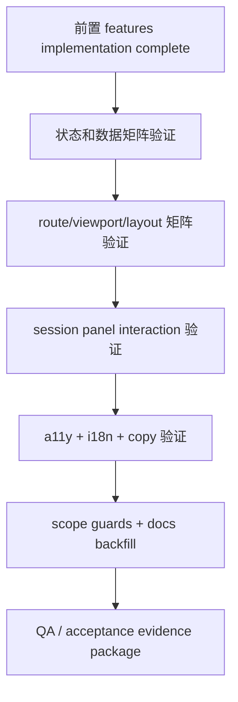

# status-bar-polish-hardening feature design

## 0. 术语约定

| 术语                   | 定义                                                                                                                                     | 防冲突结论                                                             |
| ---------------------- | ---------------------------------------------------------------------------------------------------------------------------------------- | ---------------------------------------------------------------------- |
| Polish hardening       | 状态栏核心功能已实现后的收口层：补齐视觉矩阵、状态矩阵、截图/手工验证、copy/i18n/a11y 和文档沉淀。                                       | 本 feature 不新增核心业务能力。                                        |
| Visual evidence matrix | 针对 desktop/compact、workspace/settings/sessions、ready/loading/offline/error/unsupported/empty、panel open/closed 的截图或手工证据表。 | 是 QA/验收产物，不是新的 UI 组件架构。                                 |
| Bottom chrome audit    | 对参与式 footer、safe area、keyboard shift、composer、floating panel 的最终核对。                                                        | 继承 `global-status-bar-shell` 的 bottom chrome contract，不重新设计。 |
| Status bar QA fixture  | 用于让状态栏进入特定状态的测试/开发夹具或 Playwright/组件测试数据。                                                                      | 只服务验证；不进入 daemon 协议或生产状态模型。                         |
| Documentation backfill | 把实现中确认的长期约束回写到 `docs/` 或 `.codestable/compound/`。                                                                        | 只沉淀稳定规则，不把临时 QA 记录写成永久规范。                         |

## 1. 决策与约束

### 需求摘要

本 feature 是 `global-status-bar` epic 的 UI 收口项。前置 feature 已分别定义 usage ledger、status summary protocol、app store、底部 shell 和 running sessions nav。本 feature 不再扩展功能面，而是把状态栏真正可交付所需的验证证据补齐：不同状态、不同 host route、desktop/compact、安全区/键盘、详情面板 dismiss/nav、可访问性、i18n copy、scope guard 和文档沉淀。

成功标准：

- 状态栏在 host-scoped 页面展示稳定，在 root/global routes 隐藏；切换 workspace、agent、sessions、settings 不丢底部运行状态。
- ready/loading/offline/error/unsupported/empty/old daemon gate 等状态都有可验证 UI，不出现误导性 token 数字或旧 RPC fallback。
- compact/mobile 下 bottom safe area、keyboard open/close、composer、Autocomplete/command popover、running sessions sheet 不互相遮挡或产生重复 inset。
- desktop/web 下状态栏单行稳定、DropdownMenu-based running sessions panel 定位正确，Esc/outside/route change/nav 后关闭。
- 用户可通过状态栏查看运行中/需处理/最近完成 agent session 快照并导航；不新增 close/archive/restart/cancel 等生命周期动作。
- UI copy 走 i18n 资源边界，可访问性 label/testID 足够支撑 E2E/Maestro/手工验证。
- 文档回写候选明确：bottom chrome 约束、状态栏 UI 数据流、floating panel/route gotcha 如实现中确认为长期规则则沉淀。

明确不做：

- 不新增 `status.summary.*` 协议字段、daemon 服务、usage ledger 算法或 app status store cache 语义。
- 不新增 provider usage 拉取、不把 provider quota 纳入 status summary、不做费用预测。
- 不新增 agent lifecycle mutation：不 close/archive/restart/cancel/approve/reject agent。
- 不重做 visual design 或引入新的全局 overlay primitive；只修前置 UI 的 polish/hardening 缺口。
- 不跑全量测试套件；只规定目标测试、targeted Playwright/Maestro/截图证据和 root typecheck/lint/format。
- 不把临时 QA fixture、debug console、截图输出或 TODO 留在产品代码。

### 复杂度档位

- `Compatibility = verification of feature gate`：验证新功能在 unsupported old daemon 上集中隐藏/提示，不写 fallback。
- `State = no new product state`：只允许测试 fixture、本地 open state 修正、文档和 testID/i18n/a11y 增补；不新增持久状态。
- `UI = cross-platform hardening`：重点是 desktop/compact、safe area、keyboard、panel lifecycle 和文本溢出。
- `Validation = mixed evidence`：纯函数/组件目标测试 + targeted Playwright/Maestro/手工截图 + grep scope guards。

### 关键决策

1. **收口以证据矩阵驱动，不以新增功能驱动**
   - 新增或调整的代码只允许服务于已有状态栏能力的稳定性、可验证性、可访问性或 i18n。
   - 若发现需要改协议、ledger merge semantics、app store contract，必须回到对应前置 feature/epic planning，不在 hardening 里偷改。

2. **使用已有测试入口，必要时新增 targeted status bar spec**
   - 单元/纯函数/组件目标测试沿用前置 feature 已列的 `status-summary/*` test files。
   - web/desktop 可新增一个 targeted Playwright spec（例如 `packages/app/e2e/status-bar.spec.ts`），覆盖 host route visibility、state fixture、panel open/dismiss/nav；不能跑全量 Playwright。
   - native/compact 使用 Maestro 或手工模拟器截图作为证据；若自动化成本过高，必须在 QA 记录写明设备/viewport、步骤和截图路径。

3. **copy 与 a11y 作为验收面，不作为后补**
   - Client-owned UI copy 必须走 `packages/app/src/i18n/resources/*`，并跑 i18n parity test。
   - Runtime 值（token 数、agent title、provider/model、cwd/path、raw error）保持运行时值，不翻译。
   - 状态栏 trigger、详情面板、session rows、workspace affordance、错误/空态必须有稳定 testID 或 accessibility label；Maestro 优先用 `id` 而非文本。

4. **布局验收覆盖真实风险路径**
   - `global-status-bar-shell` 的 bottom chrome contract 是本 feature 的前提：footer 拥有 bottom safe area，贴底 leaf 用 shared helper 扣减。
   - Hardening 必须证明 workspace composer、keyboard、Autocomplete/command popover、settings/sessions 底部内容与状态栏共存。
   - v1 keyboard policy 收敛为：键盘打开时 footer 仍作为 bottom chrome 渲染，composer 使用 shared helper 扣减 effective bottom inset，keyboard shift 不得额外叠加 footer 高度。若实现期真机证据证明该策略不可行，必须回 `global-status-bar-shell` 修订设计并重跑 review，不能在 hardening 中静默改成“键盘打开隐藏 footer”。

5. **文档沉淀只写稳定结论**
   - 如果 bottom chrome context 变成长期模式，回写 `docs/design.md` 或 `docs/expo-router.md` 的 host chrome 约束。
   - 如果状态栏详情面板暴露新的 Modal/DropdownMenu/floating panel 经验，回写 `docs/floating-panels.md`。
   - 如果只是一次性截图记录或临时 QA 命令，留在 feature QA/acceptance，不写入 `docs/`。

### Top 3 风险与缓解

1. **证据矩阵太宽，最后变成“看起来都试过”但缺可复现路径**
   - 缓解：把矩阵切成状态、route/layout、interaction、a11y/i18n、scope/doc 五个步骤；每项指定证据类型和最小命令/动作。
2. **hardening 偷偷扩范围修核心契约**
   - 缓解：scope guard grep 覆盖 protocol/server/client SDK/provider usage/lifecycle mutation；发现核心契约缺口则回前置 feature。
3. **compact safe area/keyboard 只能人工看，容易漏验**
   - 缓解：至少一条 iOS home-indicator 机型或等价模拟器证据；Maestro 截图从临时目录运行；记录 keyboard open/close 和 composer/panel 状态。

### 非显然依赖与关键假设

- 依赖前五个 child feature 已实现或在同一 goal 中先实现；当前仓库里它们仍是 design passed，hardening 实现必须排在它们之后。
- 入口闸门：hardening 启动前必须确认 `app-status-summary-store`、`global-status-bar-shell`、`status-bar-running-sessions-nav` 已合并，`packages/app/src/status-summary/` 存在，且前置 feature 的目标测试文件存在并可运行。若缺失，说明前置未落地，不能把 file-not-found 算作 hardening 失败。
- 依赖前置 feature 已提供可复用的 view model / component / service test seam。Hardening 只允许复用这些 seam；若没有可注入 seam，属于前置 `app-status-summary-store` 或 shell/nav 的设计/实现缺口，必须回对应 feature，不在 hardening 内新增生产可见注入点。
- 依赖目标测试可在本机局部运行；全量 test/Playwright/Maestro 仍交给 CI 或 targeted command。
- 假设第一版不要求视觉像素级 snapshot approval；截图/手工证据用于发现遮挡、溢出、错位和状态错误，不要求建立长期 snapshot baseline。
- 假设 unsupported old daemon 默认隐藏或低调提示以 shell design 最终实现为准；hardening 只验证行为一致，不重新拍板产品策略。

## 2. 名词与编排

### 2.1 名词层

#### 现状

- 前置 `global-status-bar-shell` 已定义 host layout、participating footer、bottom chrome context、状态分支和 display-only summary rows。
- 前置 `status-bar-running-sessions-nav` 已定义 activity chip in-place trigger、DropdownMenu desktop panel、AdaptiveModalSheet compact sheet、list builder、navigation executor 和 panel lifecycle。
- `docs/testing.md` 明确只跑改动相关目标测试，不跑全量 suite；App Playwright spec 通过 `npm run test:e2e --workspace=@getpaseo/app` 运行 targeted specs。
- `docs/mobile-testing.md` 明确 Maestro 截图会写当前工作目录，应 `cd /tmp/...` 后用绝对 flow 路径，且 targeting 优先 `testID/nativeID`。
- `docs/i18n.md` 明确 client-owned UI copy 进入 `packages/app/src/i18n/resources/*`，runtime values 不翻译，需跑 `resources.test.ts` parity。
- `docs/design.md` 要求状态 UI 安静、短 copy、theme token、句式 sentence case；`docs/floating-panels.md` 与 `docs/expo-router.md` 规定 anchored overlay 和 route ownership 的 gotcha。

#### 变化

新增 hardening-facing 产物契约：

```ts
type StatusBarHardeningEvidence = {
  stateMatrix: Array<"ready" | "loading" | "offline" | "error" | "unsupported" | "empty">;
  routeMatrix: Array<"workspace" | "agent" | "sessions" | "settings" | "root-hidden">;
  viewportMatrix: Array<"desktop-web" | "compact-web" | "ios-home-indicator" | "android-compact">;
  interactionMatrix: Array<
    "panel-open" | "outside-dismiss" | "route-change-dismiss" | "row-navigation" | "keyboard-open"
  >;
  evidence: Array<{
    kind: "test" | "screenshot" | "manual" | "grep";
    pathOrCommand: string;
    result: string;
  }>;
};
```

该类型是设计说明，不要求实现为生产类型。实现期可以用 QA markdown 表、Playwright test comments、Maestro output 或 acceptance 记录表达同样信息。

允许新增/调整的实现类别：

- `testID` / accessibility labels / translated copy keys。
- Targeted status bar Playwright/Maestro spec 或 test helper。
- 组件/布局 bug fix，前提是不改变前置 feature 的公开 contract。
- 文档回写与 `.codestable/compound/` 候选。

禁止新增/调整的类别：

- Protocol schema、daemon service、usage ledger merge semantics、client SDK RPC shape。
- Provider usage fetch、旧 daemon fallback、agent lifecycle mutation。
- 新持久 store、新 app-global root status bar、新 overlay primitive。

### 2.2 编排层



#### 现状

- 前置 feature 已把功能步骤分散到各自 checklist；但跨功能的组合风险（例如 ready 状态 + compact keyboard + panel open + route change）还没有统一证据入口。
- App 现有测试入口包括 colocated Vitest tests、`packages/app/e2e/*.spec.ts` Playwright、`packages/app/maestro/*` native flows、root `typecheck/lint/format:check`。
- 当前 docs 已有 design/floating/router/testing/i18n/mobile-testing 规则，但还没有 status bar bottom chrome 的实现后稳定约束。

#### 变化

- Step 0 先做前置落地闸门：确认 store/shell/nav 已合并，目标测试文件存在且可运行；前置测试在 hardening 中作为继承回归门。
- Step 1 复用前置已合并 seam 构建或确认 QA fixture：能让 app/status bar 稳定进入 ready/loading/offline/error/unsupported/empty，以及 running/attention/recent 列表组合。
- Step 2 验证 UI state matrix：所有状态固定高度、无伪造 0、长 token/agent title/cwd/provider/model 截断、loading/error/offline 文案安静。
- Step 3 验证 route/viewport/layout matrix：workspace/agent/sessions/settings/root-hidden，desktop/compact/iOS/Android，safe area/keyboard/composer/autocomplete 不遮挡。
- Step 4 验证 interaction matrix：activity trigger、desktop DropdownMenu panel、compact sheet、outside/Esc/back/route change dismiss、row navigation close-before-nav。
- Step 5 验证 a11y/i18n/copy：testID/accessibility label、translation key parity、sentence case、runtime values 不翻译。
- Step 6 跑 scope guards、目标 tests、typecheck/lint/format，并回写 docs/compound 候选。

#### 流程级约束

- 状态 fixture 不得通过生产旧 RPC fan out 或 provider fetch 造数据；只能复用前置已合并的正式 test seam。若缺少 seam，停止 hardening 并回对应前置 feature。
- Playwright/Maestro 必须是 targeted；不得运行全量 app E2E 或全量 test workspace。
- Maestro 截图必须从临时目录运行，避免 dirty checkout。
- 每个截图/手工证据必须记录 route、viewport/device、状态、预期观察点。
- 文案不应解释状态栏“如何使用”；只显示状态和可行动作。
- a11y/testID 不得依赖动态 agent title/path；动态值可在 label 中出现，但 targeting 用稳定 id。
- 如果验证发现必须改变前置 design 的 contract，停止 hardening 并回对应 feature design/epic。

### 2.3 挂载点清单

- `packages/app/src/status-summary/`：状态栏组件、running sessions 面板、testID/a11y/copy polish 和目标测试所在域；删除这些变更后 polish/hardening 行为消失。
- `packages/app/e2e/status-bar*.spec.ts` 或等价 targeted Playwright spec：desktop/web 组合验证入口。
- `packages/app/maestro/status-bar*.yaml` 或 QA 记录中的手工模拟器步骤：compact/native safe-area/keyboard 证据入口。
- `packages/app/src/i18n/resources/*`：新增 client-owned status bar copy key；删除后 copy/i18n hardening 消失。
- `docs/design.md`、`docs/expo-router.md`、`docs/floating-panels.md` 或 `.codestable/compound/*`：仅当实现确认长期 gotcha 后回写稳定规则。

### 2.4 推进策略

0. 前置落地闸门：确认 app store、shell、running sessions nav 三项已合并，`packages/app/src/status-summary/` 与前置目标测试文件存在，并记录前置测试当前结果。
   退出信号：缺文件时停止 hardening 并回前置 feature；存在时把前置测试标为“继承回归测试”，不把它们当成本 feature 独有交付。
1. QA fixture 与状态矩阵：复用前置已合并的 targetable fixture/test seam，让状态栏可稳定进入 ready/loading/offline/error/unsupported/empty 和 running/attention/recent 组合。
   退出信号：目标测试或 Playwright helper 能 deterministically 触发每个状态；没有旧 RPC fallback/provider fetch；没有新增生产可见注入 seam。
2. 视觉与状态 polish：修正固定高度、单行截断、长值、缺 cost、empty rows、unsupported/offline/error copy、theme token 和 disabled/hover/pressed 状态。
   退出信号：组件测试或截图覆盖 desktop/compact 的状态矩阵；没有 hardcoded color、负 letter spacing、动态字体缩放或布局跳动。
3. Layout/safe-area/keyboard 验证：覆盖 workspace/agent/sessions/settings/root-hidden、desktop/compact/iOS/Android、composer、keyboard、Autocomplete/command popover、bottom sheet。
   退出信号：证据矩阵记录每个核心组合；compact 下无重复 safe-area 死带；v1 keyboard policy 已验证为 footer 可见且 composer 不额外偏移 footer 高度。
4. Running sessions interaction hardening：验证 activity trigger、desktop DropdownMenu panel、compact sheet、dismiss lifecycle、route change、row navigation close-before-nav、missing workspace action。
   退出信号：targeted test 或手工证据证明 panel/sheet 不残留、不改变 footer 高度、不直接 router push、不新增 lifecycle action。
5. A11y、i18n 和 copy：补齐 stable testID/accessibility labels、translation keys、resources parity、copy style。
   退出信号：i18n parity test 通过；Maestro/Playwright selectors 使用 id；copy 遵守 sentence case、短状态词、runtime values 不翻译。
6. Scope guard、验证命令与文档回写：运行目标 tests、typecheck、lint、format check、grep；把长期规则回写 docs/compound。
   退出信号：命令通过或环境阻塞记录清楚；docs 回写只包含稳定结论；QA/acceptance 可从证据矩阵核验交付。

### 2.5 结构健康度与微重构

##### 评估

- `packages/app/src/status-summary/`：前置 features 已把 query/push/view-model/UI/panel 放在同域。Hardening 可增加测试、format/copy helpers 或 QA-only fixtures，但不能把该目录变成杂物筐；测试 helper 应贴近使用者。
- `packages/app/src/app/h/[serverId]/_layout.tsx`：应保持 route wrapper wiring，不承载 QA state 或 visual condition 分支。
- `packages/app/src/panels/agent-panel.tsx`：已有 composer/safe-area/keyboard 复杂逻辑；hardening 只允许修 bottom chrome 接入 bug，不在这里加入状态栏状态或测试 fixture。
- `packages/app/e2e/` 与 `packages/app/maestro/`：适合新增 targeted spec/flow；不应把截图输出、临时 fixture 数据或长期脆弱文本 selector 留在仓库。
- `docs/`：只沉淀跨 feature 长期约束，不保存一次性 QA 表格。

##### 结论：不做微重构

理由：该 feature 是收口验证层，主要新增测试/证据/小修和文档回写；前置设计已建立 `status-summary/` 模块边界与 bottom chrome helper。若实现中发现 `status-summary/` 文件过大或 test fixture 需要跨多处复用，最多在该目录内抽局部 helper，不做行为保持型大搬迁。若发现 `AgentPanel` keyboard/bottom inset 需要结构性拆分，应另开 `cs-refactor`，不混入本 hardening。

## 3. 验收契约

### 3.1 关键场景清单

- 正常：host workspace、agent detail、sessions、settings 页面底部状态栏可见，root/global route 隐藏。
- 正常：ready summary 展示 lifetime/today tokens、cost（有数据时）、running/attention/recent counts；缺字段不显示伪造 0。
- 正常：running sessions trigger 打开 desktop panel/compact sheet，点击 agent row 先关闭再导航。
- 正常：workspace secondary action 仅在 live/known workspace 显示；missing/archived workspace 不显示 workspace action。
- 边界：loading/offline/error/unsupported/empty 都保持固定高度或隐藏策略一致，不导致页面跳高或误导数据。
- 边界：长 token 数、长 agent title、长 cwd、长 provider/model 在 desktop/compact 下单行截断，不撑高 footer/panel。
- 边界：compact/iOS home indicator 下 footer 背景覆盖 safe area，composer 与状态栏之间无重复 inset。
- 边界：keyboard open/close 后 footer 仍可见，composer 不多偏移 footer 高度；Autocomplete/command popover 不被 footer 或 sheet 裁切。
- 边界：desktop panel Esc/outside press/route change/serverId change/view non-ready 后关闭；footer 高度不变。
- 边界：native/compact 不依赖 hover 才显示可操作 trigger。
- 错误：old daemon unsupported 不调用 `status.summary.get` 或旧 RPC fallback；provider usage 不被拉取。
- 错误：daemon/app offline 或 summary fetch error 不崩溃，不显示 stale 数据为 fresh。
- 范围：不新增 protocol/server/provider usage/lifecycle mutation/root layout status bar。
- 文档：实现中确认的 bottom chrome/floating/router gotcha 已回写或明确记录“不需要回写”。

### 3.2 明确不做的反向核对项

- diff 中不应新增 `packages/protocol`、`packages/client`、`packages/server` 的 status summary contract 改动。
- diff 中不应出现 provider usage fetch、`provider.usage.list`、`listProviderUsage`、旧 `fetchAgents`/timeline 拼 summary。
- diff 中不应新增 `archiveAgent`、`cancelAgent`、`restart`、`closeAgent` 等 lifecycle mutation。
- diff 中不应直接 import `router` 或拼 `buildHostAgentDetailRoute` / `buildHostWorkspaceRoute`。
- diff 中不应新增 `useUnistyles()`、hardcoded hex、临时 console/debug、TODO/FIXME、注释掉代码。
- diff 中不应把 status bar 挂到 root `packages/app/src/app/_layout.tsx` 或无 host route。
- QA 截图不应落在 checkout 内；Maestro 截图从 `/tmp` 类目录运行。

### 3.3 Acceptance Coverage Matrix

| Scenario                                                   | Covered By Step | Evidence Type               | Command / Action                                                                                                             | Core? |
| ---------------------------------------------------------- | --------------- | --------------------------- | ---------------------------------------------------------------------------------------------------------------------------- | ----- |
| State matrix ready/loading/offline/error/unsupported/empty | S1/S2           | component test / screenshot | `global-status-bar` target test + desktop/compact screenshot                                                                 | yes   |
| Host route visibility and root hidden                      | S3              | Playwright / manual QA      | targeted `status-bar` E2E or route screenshot matrix                                                                         | yes   |
| Bottom safe-area and composer no duplicate inset           | S3              | Maestro/manual screenshot   | iOS home-indicator or simulator keyboard scenario                                                                            | yes   |
| Keyboard and autocomplete/popover alignment                | S3              | manual QA / screenshot      | open composer keyboard + command/autocomplete popover; footer remains visible and composer has no extra footer-height offset | yes   |
| Desktop panel dismiss and route-change close               | S4              | Playwright / manual QA      | open panel, Esc/outside, route change                                                                                        | yes   |
| Compact sheet open/close/navigation                        | S4              | Maestro/manual QA           | compact/native sheet scenario                                                                                                | yes   |
| A11y/testID/i18n copy                                      | S5              | unit test / diff review     | `resources.test.ts` + selector audit                                                                                         | yes   |
| No protocol/provider/lifecycle/root-layout scope creep     | S6              | grep / diff review          | scope guard commands                                                                                                         | yes   |
| Docs/compound backfill decision                            | S6              | diff review / QA record     | docs changed or explicit no-backfill note                                                                                    | no    |

### 3.4 DoD Contract

- Design DoD：design、checklist、design-review 落盘；roadmap item 关联 feature。
- Implementation DoD：入口闸门证明前置三项已落地；状态矩阵、layout矩阵、interaction矩阵、a11y/i18n、scope guards、文档回写决策均完成。本 feature 独有交付是 targeted status-bar spec/flow、a11y/i18n/copy polish、docs/compound 回写和证据矩阵；前置测试作为继承回归门，不单独记为 hardening 功能交付。
- Review DoD：code review 重点核对 hardening 没有扩协议/daemon/store contract、没有 lifecycle mutation、没有 root layout 挂载、没有 unsafe safe-area/keyboard regressions。
- QA DoD：目标 tests、targeted desktop/compact evidence、i18n parity、typecheck/lint/format/scope grep 有结果；环境阻塞记录具体。
- Acceptance DoD：用户能在同一 host 内持续看到底部状态和运行 session 快照，切 route/开键盘/打开面板/导航后状态栏稳定；旧 daemon/unsupported 不误导。

### 3.5 必跑验证命令

| id      | command                                                                                                                                                                                                                                                                          | core              | failure_handling                                                                                                               |
| ------- | -------------------------------------------------------------------------------------------------------------------------------------------------------------------------------------------------------------------------------------------------------------------------------- | ----------------- | ------------------------------------------------------------------------------------------------------------------------------ | -------------------------------------------------------------------------------------------------------------- | ------------ | -------------------------------------------------------------------------------------------------------------------------- | ------- | ---------- | --------- | ------------------------- | ----------------------- | ------------ | ---------- | ---- | ------------------------------------------------------------------------------------------------------------- | ---- | ------------------------------------------------------------------------------------------------------- |
| CMD-000 | `test -d packages/app/src/status-summary && test -f packages/app/src/status-summary/global-status-bar.test.tsx && test -f packages/app/src/status-summary/status-bar-session-navigation.test.ts && test -f packages/app/src/status-summary/status-bar-running-sessions.test.tsx` | true              | 失败表示前置 store/shell/nav 未合并或文件名已漂移；停止 hardening，回前置 feature 或明确等价目标测试路径。                     |
| CMD-001 | `npx vitest run packages/app/src/status-summary/global-status-bar.test.tsx --bail=1`                                                                                                                                                                                             | true              | 继承回归测试。失败则回实现修状态分支/layout contract；file-not-found 按 CMD-000 处理；若文件名调整，用等价目标测试替代并记录。 |
| CMD-002 | `npx vitest run packages/app/src/status-summary/status-bar-session-navigation.test.ts --bail=1`                                                                                                                                                                                  | true              | 继承回归测试。失败则回实现修 list builder/navigation target；file-not-found 按 CMD-000 处理。                                  |
| CMD-003 | `npx vitest run packages/app/src/status-summary/status-bar-running-sessions.test.tsx --bail=1`                                                                                                                                                                                   | true              | 继承回归测试。失败则回实现修 trigger/panel/sheet lifecycle；file-not-found 按 CMD-000 处理。                                   |
| CMD-004 | `npx vitest run packages/app/src/i18n/resources.test.ts --bail=1`                                                                                                                                                                                                                | true              | 失败则补齐 en/ar/es/fr/ja/pt-BR/ru/zh-CN 所有 locale key 或移除未迁移 copy。                                                   |
| CMD-005 | `npm run test:e2e --workspace=@getpaseo/app -- status-bar`                                                                                                                                                                                                                       | false             | 仅当新增 targeted Playwright spec 时运行；失败则回实现修或记录环境阻塞。不得跑全量 Playwright。                                |
| CMD-006 | `npm run typecheck`                                                                                                                                                                                                                                                              | true              | 若跨包声明 stale，先按 AGENTS 指令 build 对应 stack 后复跑。                                                                   |
| CMD-007 | `npm run lint`                                                                                                                                                                                                                                                                   | true              | 只接受无关既有红灯并记录证据；本 feature 红灯必须修。                                                                          |
| CMD-008 | `npm run format:check`                                                                                                                                                                                                                                                           | true              | 失败则运行 `npm run format` 后复查。                                                                                           |
| CMD-009 | `rg "provider\\.usage\\.list                                                                                                                                                                                                                                                     | listProviderUsage | fetchAgents                                                                                                                    | timeline                                                                                                       | archiveAgent | cancelAgent                                                                                                                | restart | closeAgent | router\\. | buildHostAgentDetailRoute | buildHostWorkspaceRoute | useUnistyles | console\\. | TODO | FIXME" packages/app/src/status-summary packages/app/e2e/status-bar*.spec.ts packages/app/maestro/status-bar*` | true | 有命中必须分类；越界命中移除或回 design。若 status-bar E2E/Maestro 文件未新增，对缺失 glob 做人工说明。 |
| CMD-010 | `rg "HostStatusBar                                                                                                                                                                                                                                                               | GlobalStatusBar   | status\\.summary                                                                                                               | HostStatusSummaryPayload" packages/app/src/app/\_layout.tsx packages/protocol packages/client packages/server` | true         | root layout 或协议/server/client 越界命中必须移除；前置 protocol/client/server 既有合法实现需人工分类为非 hardening diff。 |

## 4. 架构与文档回写预判

- `docs/design.md`：若 bottom chrome footer 成为长期 app chrome 模式，补一段“host bottom status bar / bottom chrome”规则，说明状态栏是参与式 footer、低对比、单行、safe-area ownership，以及 v1 keyboard policy：键盘打开时 footer 仍可见且 composer 通过 effective inset 避免重复偏移。
- `docs/expo-router.md`：若实现中确认 host layout bottom chrome 对 route ownership 有稳定约束，补 host layout chrome 说明，继续禁止 root layout 全局 host 选择。
- `docs/floating-panels.md`：若 DropdownMenu-based bottom anchored panel 或 compact sheet 产生新的 dismiss/keyboard gotcha，补到 floating panel gotchas。
- `docs/mobile-testing.md`：若新增 status bar Maestro flow/截图脚本形成可复用模式，可补 targeted screenshot workflow 说明。
- `.codestable/compound/`：若文档暂不适合对外沉淀，至少记录 bottom chrome/status bar QA 的 project-local learning。

## 5. 清洁度规则

- 不留下 TODO/FIXME、注释掉代码、临时 console/debug 输出、截图产物或手工 QA 临时文件。
- 不新增 hardcoded hex、one-off spacing、viewport-scaled font、负 letter spacing、装饰 gradient/orb。
- 不新增 `useUnistyles()`；遵守现有 `StyleSheet.create((theme) => ...)` 或前置组件模式。
- 不用文本 selector 作为唯一 E2E/Maestro target；新增可操作元素必须有 stable testID 或 accessibility label。
- 不把用户说明写进状态栏 UI；状态栏只显示短状态、数值、动作名。
- 不在 hardening 中修改前置协议/daemon/store contract；发现契约问题要回对应 feature。
