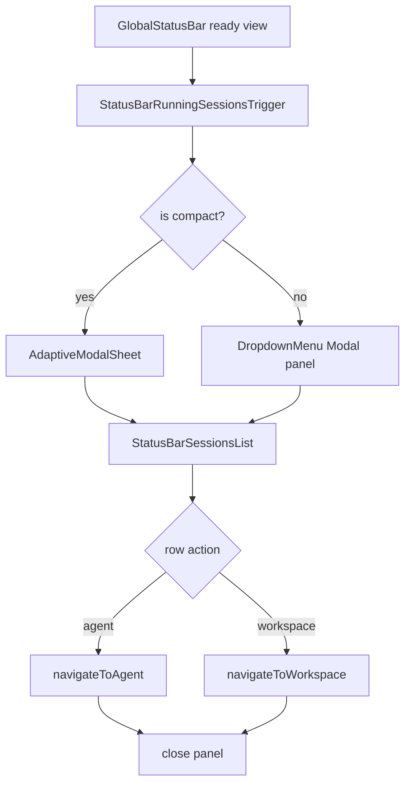

# status-bar-running-sessions-nav feature design

## 0. 术语约定

| 术语                     | 定义                                                                                                      | 防冲突结论                                                                                 |
| ------------------------ | --------------------------------------------------------------------------------------------------------- | ------------------------------------------------------------------------------------------ |
| Running session snapshot | `StatusAgentSnapshot` 中来自 `runningAgents` 的一条当前运行 agent/session 摘要。                          | UI 可称 "agent session"，代码沿用 DTO 的 `StatusAgentSnapshot`。                           |
| Status bar detail panel  | 点击状态栏运行状态后出现的详情面板，列出 running / needs attention / recently completed agent snapshots。 | 本 feature 新增；不是 provider usage，也不是历史 sessions 页替代品。                       |
| Navigation action        | 从详情条目跳转到 agent detail 或 workspace 的动作。                                                       | 只复用现有 `navigateToAgent` / `navigateToWorkspace`，不手写复杂 Expo Router 路由。        |
| Desktop anchored panel   | desktop/web 上从状态栏触发的锚定浮层。                                                                    | 优先复用 `DropdownMenu` 的 Modal positioning/dismiss 内核，而不是手搓 Portal measurement。 |
| Compact sheet            | compact/native 上展示详情列表的 bottom sheet。                                                            | 复用 `<AdaptiveModalSheet>`，避免 Android overflow hit-test 问题。                         |

## 1. 决策与约束

### 需求摘要

本 feature 在前一条 `global-status-bar-shell` 的 display-only 状态栏基础上，增加运行中 session 快照入口：用户点击状态栏的 running/attention 区域后，可看到当前 running、needs attention、recently completed 的 agent session 列表，并能点条目导航到对应 agent 或 workspace。

成功标准：

- 状态栏 ready 且有 agent snapshots 时，提供一个明确、低调的可点击入口。
- desktop/web 上打开锚定详情面板；compact/native 上打开 sheet；两者内容一致。
- 条目显示 agent 标题/状态/provider、workspace/cwd 简要信息、最近 usage 或更新时间。
- 点击 agent 条目使用 `navigateToAgent({ serverId, agentId, workspaceId })`；没有 workspaceId 时仍可跳 agent detail。
- 点击 workspace affordance（如果设计显示）使用 `navigateToWorkspace(serverId, workspaceId)`；缺 workspaceId 时不显示 workspace 导航。
- 导航后关闭面板/sheet，不留下悬浮层或 hover stuck state。

明确不做：

- 不改 `HostStatusSummaryPayload` / `StatusAgentSnapshot` 协议字段；只消费前置 summary/store 形状。
- 不实现 provider usage 详情入口、不 fetch provider usage、不改 provider settings。
- 不归档、关闭、重启、取消 agent；详情面板只读并导航。
- 不做完整 sessions/history 页面；recently completed 只展示 summary payload 已给的短列表。
- 不在无 host 的 root/global routes 上显示或导航。

### 复杂度档位

- `Interaction = cross-platform overlay + navigation`：需要处理 desktop anchored panel、compact sheet、dismiss、focus/route lifecycle。
- `State = ephemeral UI state`：只保存 panel open/closed，不持久化、不写 session store。
- `Routing = existing helpers only`：agent/workspace navigation 只通过现有 helper，遵守 Expo Router route ownership。
- `Data = read-only snapshots`：不补 fetch、不从 session store 拼缺字段。

### 关键决策

1. **状态栏壳把 activity chip 升级为详情触发点**
   - `GlobalStatusBar` 或其内部 ready 分支把 `runningAgents/needsAttentionAgents/recentlyCompletedAgents` 传给 `StatusBarRunningSessionsTrigger`。
   - trigger 接管前置 shell 已有的 running/attention activity affordance，是 in-place 升级，不新增并列 "Agents" 区域，避免重复 count 或撑高 footer。
   - trigger 必须有固定 hit area，不因 panel open 改变高度/宽度。

2. **desktop 用 DropdownMenu anchored panel，compact 用 AdaptiveModalSheet**
   - desktop panel 锚定状态栏 trigger，优先复用 `DropdownMenu` / `DropdownMenuContent` 的 Modal、measure/computePosition、backdrop、Esc/back 和 outside-press 关闭能力，content 替换为 `StatusBarSessionsList`。
   - 不手搓 `Portal + FloatingSurface + host-relative measurement`，除非实现期证明 `DropdownMenuContent` 无法承载该 content；若走自定义浮层，必须复刻 backdrop/Esc/outside-press/有界高度/无测量 flash。
   - compact/native 使用 `<AdaptiveModalSheet>`，让 Android hit-test、安全区和 keyboard/backdrop 行为交给现有 primitive。

3. **导航动作集中为 list builder + deps-injected executor**
   - `buildStatusBarSessionList(attention, running, recent, deps)` 负责分组、去重、target 构建和 workspace availability 判定。
   - `navigateToStatusBarSession(target, deps)` 调现有 helper：
     - agent：`navigateToAgent({ serverId, agentId: snapshot.id, workspaceId: snapshot.workspaceId ?? null })`
     - workspace：`navigateToWorkspace(serverId, snapshot.workspaceId)`，但只在 workspace 当前 live/known 时显示该 action。
   - 不直接 `router.push()` 拼 route，避免绕开 workspace restore / mounted route 规则。

4. **列表分组顺序固定**
   - 先 `needsAttentionAgents`，再 `runningAgents`，再 `recentlyCompletedAgents`。
   - 同一个 agent 若出现在多个列表，按上述优先级去重，避免面板重复行。
   - 空列表时 trigger 不显示或 disabled；如果打开后变空，面板显示简短空态并可关闭。

5. **面板是 action surface，不是 dashboard**
   - 每行是一条可扫状态记录，最多两个动作：主点击打开 agent，辅助 workspace（仅当 workspaceId 存在、workspace 当前 live/known 且 UI 有空间）。
   - 不展示长日志、不展示完整 token breakdown、不展示操作按钮。

### Top 3 风险与缓解

1. **导航绕开 Expo Router / workspace helper 造成隐藏 deck 或 restore bug**
   - 缓解：design 明确只调用 `navigateToAgent` / `navigateToWorkspace`；checklist 与 grep 禁止直接 `router.push` / `buildHostAgentDetailRoute`。
2. **desktop anchored panel 与底部状态栏/safe area/keyboard 交互错位**
   - 缓解：desktop panel 优先复用 `DropdownMenu` 的 Modal/computePosition/dismiss 内核；compact 用 sheet；验收包含 open/close、resize、route change。
3. **hover/press trigger 导致状态栏高度跳动或 native 无法操作**
   - 缓解：trigger 固定尺寸，hover 只改颜色/opacity；native/compact 始终可见，不依赖 hover。

### 非显然依赖与关键假设

- 依赖 `global-status-bar-shell` 已实现底部状态栏、bottom chrome context 和 ready view model。
- 依赖 `app-status-summary-store` view model 已暴露 `runningAgents` / `needsAttentionAgents` / `recentlyCompletedAgents`，且每项是 `StatusAgentSnapshot`。
- `navigateToAgent` 已处理 workspace tab、archived workspace restore 和 agent detail fallback；本 feature 不复制这些逻辑。
- `navigateToWorkspace` 已处理 host workspace route navigation 和 remembered workspace；本 feature 不直接改 route state。
- `navigateToWorkspace` 不负责 archived workspace restore；workspace secondary action 只对 live/known workspace 显示。archived/gone workspace 仍可通过 agent primary action 交给 `navigateToAgent` 的 restore/fallback 逻辑。
- `StatusAgentSnapshot.workspaceId` 是可选字段；缺失时只能 agent 导航，不能 workspace 导航。类型按协议对齐为 `workspaceId?: string`，UI 内部可规范化为 `string | null`。

## 2. 名词与编排

### 2.1 名词层

#### 现状

- `packages/app/src/utils/navigate-to-agent/index.ts` 暴露 `navigateToAgent(input)`，内部通过 `resolveNavigateToAgent` 决定 agent detail route 或 prepared workspace tab，并处理 archived workspace restore。
- `packages/app/src/stores/navigation-active-workspace-store/index.ts` 暴露 `navigateToWorkspace(serverId, workspaceId)`，内部使用 `navigateToHostWorkspaceRoute` 避免重复 global-route hops 追加隐藏 deck。
- `packages/app/src/stores/navigation-active-workspace-store/navigation.ts` 的 `navigateToWorkspace` 会读取当前 session workspaces/agents 选 attention agent，但不做 archived workspace restore；对不在 store 的 workspace 不应作为 secondary workspace action 暴露。
- `docs/expo-router.md` 明确 app-wide route hops 应使用 `navigateToWorkspace()`，不要由调用者按当前 route 分支。
- `docs/floating-panels.md` 要求 anchored popover 使用 Portal/Modal 逃逸 Android hit-test，并处理 lifecycle、host-relative measurement。
- `docs/hover.md` 要求 hover tracking 与 press 分离，native/compact 不能依赖 hover 才显示控件。
- `packages/app/src/components/ui/dropdown-menu.tsx` 的 `DropdownMenuContent` 已内建 Modal、backdrop、`onRequestClose`、trigger measurement、`computePosition`、scrollable/maxHeight，并接受任意 children，可作为 desktop anchored panel 的基础。
- `packages/app/src/utils/time.ts` 提供 `formatTimeAgo`，`components/context-window-meter.utils.ts` 提供 `formatTokenCount`；行内 `updatedAt` / `lastUsage` 文案应复用这些 helper。

#### 变化

新增 UI/logic shape：

```ts
type StatusBarSessionGroupKind = "attention" | "running" | "recent";

type StatusBarSessionListItem = {
  key: string;
  group: StatusBarSessionGroupKind;
  snapshot: StatusAgentSnapshot;
  primaryTarget: { kind: "agent"; serverId: string; agentId: string; workspaceId?: string | null };
  workspaceTarget?: { kind: "workspace"; serverId: string; workspaceId: string };
};

type StatusBarSessionPanelProps = {
  serverId: string;
  open: boolean;
  onOpenChange: (open: boolean) => void;
  anchorRef?: React.RefObject<View | null>;
  runningAgents: StatusAgentSnapshot[];
  needsAttentionAgents: StatusAgentSnapshot[];
  recentlyCompletedAgents: StatusAgentSnapshot[];
};
```

组件职责：

- `StatusBarRunningSessionsTrigger`：固定尺寸 trigger，显示 running/attention count，并控制 panel/sheet open state；它是 shell activity chip 的 in-place 升级，不新增并列区域。
- `StatusBarSessionsPanel`：根据 compact/desktop 选择 DropdownMenu-based anchored panel 或 `AdaptiveModalSheet`。
- `StatusBarSessionsList`：纯展示分组、空态和行。
- `status-bar-session-navigation.ts`：`buildStatusBarSessionList(...)` 构建列表项与 target，deps-injected executor 只调用 `navigateToAgent` / `navigateToWorkspace`，便于单测。
- `status-bar-session-format.ts` 或等价 helper：集中复用 `formatTimeAgo` / `formatTokenCount` 格式化 per-agent `updatedAt` / `lastUsage`，避免在 list row 内手写格式化。

### 2.2 编排层



#### 现状

- `global-status-bar-shell` 设计中 `GlobalStatusBar` 只展示 display-only rows，不做 panel/nav。
- Root 与 workspace 已有 `FloatingPanelPortalHost`； workspace-specific portal host 存在，但 status bar 属 host shell，不在 workspace pane 内。
- `AdaptiveModalSheet` 已承担 compact bottom sheet / desktop modal 模式，但本 feature desktop 需要 anchored panel 而非 centered modal。

#### 变化

- `GlobalStatusBar` ready 分支接入 `StatusBarRunningSessionsTrigger`。
- trigger 持有本地 `isOpen` state；summary kind 变为 non-ready、serverId 变化、`usePathname()` 变化、focus mode hidden 或 navigation 成功时关闭。
- desktop anchored panel：
  - 使用 `DropdownMenu` 受控 open state 和 `DropdownMenuContent`，把 content 替换为 `StatusBarSessionsList`。
  - 复用 DropdownMenu 的 Modal/backdrop/Esc/back/outside-press/positioning/scrollable/maxHeight 能力；不重复实现 host-relative measurement。
  - panel 最大高度固定，列表可滚动；打开时不改变状态栏 footer 高度。
  - 点击外部、Esc/back、route change、summary 变空时关闭。
- compact sheet：
  - 使用 `AdaptiveModalSheet`，header title 使用短文案如 "Agent sessions"。
  - rows 使用同一 `StatusBarSessionsList`。
  - 关闭由 `onOpenChange(false)` 控制；row press 与 desktop 一致，先关闭再导航。
- navigation：
  - row primary press 调 `navigateToAgent({ serverId, agentId: snapshot.id, workspaceId: snapshot.workspaceId ?? null })`。
  - workspace secondary action 仅当 `workspaceId` 是非空 string 且能在当前 session workspaces 中解析为 live/known workspace 时显示并调用 `navigateToWorkspace(serverId, workspaceId)`。
  - action handler 先关闭 panel 再导航，避免新 route 上残留 Modal/panel。

#### 流程级约束

- No direct router：本模块不得直接 import `router`、不得直接调用 `buildHostAgentDetailRoute` / `buildHostWorkspaceRoute` 拼路由。
- Dedup：同一 agent 出现在 attention/running/recent 多组时只显示一次，优先级 attention > running > recent。
- Missing workspaceId：agent row 仍可导航；workspace action 隐藏，不能从 `cwd` 推导 workspace ownership。
- Archived/missing workspace：workspace action 隐藏；agent primary action 仍传 workspaceId 给 `navigateToAgent`，由其 restore/fallback 逻辑处理。
- Panel lifecycle：serverId 变化、view model 非 ready、trigger unmount、`usePathname()` route change、navigation success 时关闭 panel。
- Hover：desktop hover 只影响 row background/text color，不改变 trigger/panel 几何；native/compact 不依赖 hover。
- Accessibility：trigger/rows 有 role/label；Esc/backdrop/back button 可关闭。
- Provider usage：不在 panel 中加入 provider quota 或 usage 入口。
- Safe area：compact sheet 的 bottom safe area 交给 `AdaptiveModalSheet`；desktop panel 的 Modal/backdrop 不改变 bottom chrome context，也不改变 footer 高度。

### 2.3 挂载点清单

- `packages/app/src/status-summary/global-status-bar.tsx`：把 shell 既有 activity chip in-place 升级为 running sessions trigger。
- `packages/app/src/status-summary/status-bar-running-sessions.tsx`：新增 trigger、DropdownMenu desktop panel、compact sheet、列表 UI。
- `packages/app/src/status-summary/status-bar-session-navigation.ts`：新增 list item builder 和 navigation executor。
- `packages/app/src/status-summary/status-bar-session-format.ts` 或等价 helper：集中 per-agent usage/time 文案格式化。
- `packages/app/src/status-summary/status-bar-running-sessions*.test.tsx` / `status-bar-session-navigation.test.ts`：覆盖分组、状态、导航 target 与 scope guard。

### 2.4 推进策略

1. List model、formatting 与 navigation resolver：实现 snapshot 分组、去重、target 构建、per-agent usage/time 格式化和 deps-injected navigate executor。
   退出信号：单测覆盖 attention/running/recent 优先级、缺 workspaceId、missing/archived workspace 隐藏 workspace action、agent/workspace action 分别调用正确 helper、format helper 复用。
2. Trigger 接入：把 shell 既有 activity chip in-place 升级为固定尺寸 running sessions trigger，空列表时 disabled/hidden。
   退出信号：组件测试证明 trigger 不改变 footer 高度、不重复渲染 count；native/compact 不依赖 hover。
3. Compact sheet：用 `AdaptiveModalSheet` 渲染同一列表，支持关闭、空态、row press 后关闭并导航。
   退出信号：组件测试或手工验证 compact open/close、backdrop/back 关闭、safe area 正常。
4. Desktop anchored panel：用 DropdownMenu 的 Modal/position/dismiss 内核承载 `StatusBarSessionsList`。
   退出信号：desktop web 手工/截图验证 panel 锚定状态栏、不改变 footer 高度，Esc/back、outside press、route change 关闭。
5. 范围守护与验证：运行目标测试、typecheck、lint、format check 和 grep。
   退出信号：无直接 router/build route/provider usage/agent mutation 调用；验证命令通过或记录环境阻塞。

### 2.5 结构健康度与微重构

##### 评估

- `global-status-bar.tsx`：应只接入 trigger，不承载 panel 测量、分组、导航逻辑。
- `status-summary/`：已有 app store/shell 域，新建 running sessions 文件同域合理；保持 query/push/view-model/UI 分离。
- `navigate-to-agent` / `navigation-active-workspace-store`：已有深 helper，不需要扩展；本 feature 只调用。
- `DropdownMenu` / `AdaptiveModalSheet`：可复用；不为这一个面板抽新的全局 overlay primitive。若实现期必须抽取 DropdownMenu 内核，也应是局部复用，不引入新全局 primitive。

##### 结论：不做微重构

理由：新增面板可落在 `status-summary/` 独立文件，导航逻辑可单独测试；现有导航 helper 已足够深，不需要改 route 层结构。

## 3. 验收契约

### 3.1 关键场景清单

- 正常：ready summary 有 runningAgents → 状态栏显示可点击入口，打开列表。
- 正常：needsAttention/running/recent 三组都有数据 → 面板按 attention、running、recent 顺序展示，同 agent 去重。
- 正常：点击 agent row → 调用 `navigateToAgent({ serverId, agentId, workspaceId })` 并关闭面板。
- 正常：点击 workspace action → 调用 `navigateToWorkspace(serverId, workspaceId)` 并关闭面板。
- 边界：snapshot 缺 workspaceId → agent row 仍可导航，workspace action 不显示。
- 边界：workspaceId 指向 archived/missing workspace → agent row 仍可通过 `navigateToAgent` 处理 restore/fallback，workspace action 不显示。
- 边界：列表为空或 view 非 ready → trigger disabled/hidden，已打开面板关闭或显示空态。
- 边界：compact/native → 使用 sheet，可通过 backdrop/back/close 关闭，safe area 正常。
- 边界：desktop/web → DropdownMenu-based anchored panel 锚定状态栏 trigger，Esc/back/outside/route change 可关闭。
- 错误：长 title/cwd/provider/model → 单行截断，不撑破 panel 或 footer。
- 范围：不直接 router push、不拼 route、不 fetch provider usage、不新增 agent lifecycle 操作。

### 3.2 明确不做的反向核对项

- diff 中不应新增 protocol/schema/client/server 改动。
- diff 中不应直接 import `router` 或调用 `router.push` / `router.navigate`。
- diff 中不应直接调用 `buildHostAgentDetailRoute` / `buildHostWorkspaceRoute`。
- diff 中不应调用 `provider.usage.list`、`listProviderUsage`、daemon client summary fetch、`fetchAgents` 或 timeline API。
- diff 中不应新增 archive/close/restart/cancel agent 操作。
- diff 中不应新增 `useUnistyles()`。

### 3.3 Acceptance Coverage Matrix

| Scenario                                                          | Covered By Step | Evidence Type              | Command / Action                                                                                | Core?                     |
| ----------------------------------------------------------------- | --------------- | -------------------------- | ----------------------------------------------------------------------------------------------- | ------------------------- | ----------------------- | ----------------------- | ----------------- | ----------- | ------------ | ----------- | ----------------------------------------- | --- |
| List grouping and dedup priority                                  | S1              | unit test                  | `npx vitest run packages/app/src/status-summary/status-bar-session-navigation.test.ts --bail=1` | yes                       |
| Agent/workspace navigation uses helpers                           | S1/S5           | unit test / grep           | target test + scope grep                                                                        | yes                       |
| Missing/archived workspace hides workspace action                 | S1              | unit test                  | list builder target test                                                                        | yes                       |
| Trigger in-place upgrade and disabled/empty behavior              | S2              | component test             | `npx vitest run packages/app/src/status-summary/status-bar-running-sessions.test.tsx --bail=1`  | yes                       |
| Compact sheet opens/closes and row press closes before navigation | S3              | component test / manual QA | compact viewport/simulator                                                                      | yes                       |
| Desktop DropdownMenu-based panel positions and dismisses          | S4              | screenshot / manual QA     | desktop web open/Esc/back/outside/route change                                                  | yes                       |
| Scope guard no direct routing/fetch/mutation                      | S5              | grep / diff review         | `rg "router\\.                                                                                  | buildHostAgentDetailRoute | buildHostWorkspaceRoute | provider\\.usage\\.list | listProviderUsage | fetchAgents | archiveAgent | cancelAgent | restart" packages/app/src/status-summary` | yes |

### 3.4 DoD Contract

- Design DoD：design、checklist、design-review 落盘；roadmap item 关联 feature。
- Implementation DoD：trigger、panel/sheet、list grouping、navigation actions、dismiss lifecycle、scope guards 都实现。
- Review DoD：code review 重点核对导航 helper 使用、Portal/sheet lifecycle、hover/native fallback、无 lifecycle mutation。
- QA DoD：目标测试通过；desktop anchored panel 与 compact sheet 至少各一次手工或截图验证。
- Acceptance DoD：用户能从状态栏查看 running session 快照并导航到对应 agent/workspace，切换 route 后无残留面板。

### 3.5 必跑验证命令

| id      | command                                                                                         | core                      | failure_handling                                      |
| ------- | ----------------------------------------------------------------------------------------------- | ------------------------- | ----------------------------------------------------- | ----------------------- | ----------------- | ----------- | ------------ | ----------- | ------- | ---------------------------------------------- | ---- | ----------------------------------------- |
| CMD-001 | `npx vitest run packages/app/src/status-summary/status-bar-session-navigation.test.ts --bail=1` | true                      | 失败则回实现修 resolver 或测试夹具。                  |
| CMD-002 | `npx vitest run packages/app/src/status-summary/status-bar-running-sessions.test.tsx --bail=1`  | true                      | 失败则回实现修状态/交互。                             |
| CMD-003 | `npm run typecheck`                                                                             | true                      | 若跨包声明 stale，先按 AGENTS 指令 build 对应 stack。 |
| CMD-004 | `npm run lint`                                                                                  | true                      | 只接受无关既有红灯并记录证据。                        |
| CMD-005 | `npm run format:check`                                                                          | true                      | 失败则运行 `npm run format` 后复查。                  |
| CMD-006 | `rg "router\\.                                                                                  | buildHostAgentDetailRoute | buildHostWorkspaceRoute                               | provider\\.usage\\.list | listProviderUsage | fetchAgents | archiveAgent | cancelAgent | restart | useUnistyles" packages/app/src/status-summary` | true | 有命中必须分类；越界命中移除或回 design。 |

## 4. 架构与文档回写预判

- 若 anchored bottom panel 对 floating panel docs 暴露新 gotcha，应在 acceptance/polish 阶段沉淀到 `docs/floating-panels.md`。
- 若 navigation helper 使用暴露新的 workspace/agent route 约束，应回写 `docs/expo-router.md` 或 `.codestable/compound/`。

## 5. 清洁度规则

- 不留下 TODO/FIXME、注释掉代码、临时 console/debug 输出。
- 不新增硬编码颜色、阴影或装饰 gradient；panel 遵守 theme tokens。
- 不新增 `useUnistyles()`。
- 不把 row 做成大卡片；列表保持紧凑、可扫、可点击。
- 不新增解释性 UI 文案教用户如何使用状态栏。
