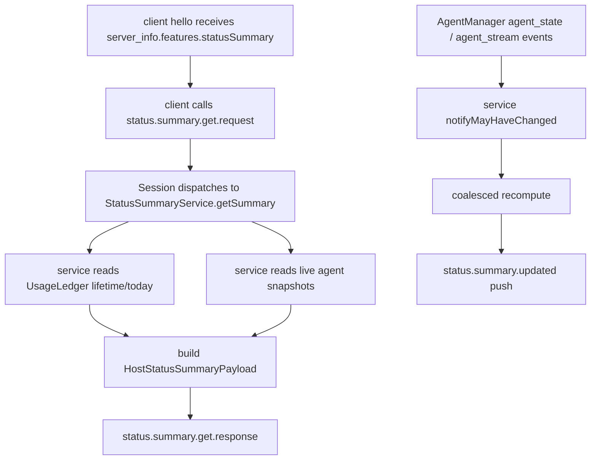

# status-summary-protocol feature design

## 0. 术语约定

| 术语                                  | 定义                                                                      | 防冲突结论                                                                             |
| ------------------------------------- | ------------------------------------------------------------------------- | -------------------------------------------------------------------------------------- |
| Status Summary Service                | daemon 内把 usage ledger 与 agent snapshots 聚合成 host summary 的服务。  | 新模块，落在 `packages/server/src/server/status-summary/`，不放进 app store。          |
| `HostStatusSummaryPayload`            | daemon → client/app 的稳定 DTO，包含 usage totals 和 activity snapshots。 | 取自 roadmap §4.3；v1 不含 provider plan usage。                                       |
| `status.summary.get.request/response` | client 主动获取当前 host summary 的 namespaced RPC。                      | 新 dotted RPC，遵守 `docs/rpc-namespacing.md`。                                        |
| `status.summary.updated`              | daemon 推送完整 summary snapshot 的无 response notification。             | 新 push message；必须在 schema 附近注明无 response 命名理由，或补 docs push 命名约定。 |
| `statusSummary` feature gate          | `server_info.features.statusSummary`。                                    | 新 app/client 是否可用该 feature 的唯一 gate；不做旧 daemon fallback。                 |

## 1. 决策与约束

### 需求摘要

本 feature 完成全局状态栏最小数据闭环的第二段：在 usage ledger 已提供 persisted lifetime/today totals 后，daemon 暴露 host 级 `HostStatusSummaryPayload`，client SDK 能通过 RPC 读取并订阅 push 更新。完成后无需 UI，即可用目标测试证明新 daemon 能返回包含 persisted usage totals 和 active session snapshot 的 summary。

成功标准：

- protocol schema 定义 `status.summary.get.request/response`、`status.summary.updated` 和 `HostStatusSummaryPayload`，保持向后兼容。
- websocket `server_info.features.statusSummary === true` 暴露 capability，并带 `COMPAT(statusSummary)` 注释。
- server session 能处理 get request；daemon singleton summary service 在 `AgentManager` 事件后 coalesce 推送 updated。
- client SDK 提供 `getStatusSummary()` 和 `on("status.summary.updated")` 可消费的 typed message。

明确不做：

- 不做 app store、React hook、view model、UI status bar 或 navigation。
- 不 fan out 到旧 RPC 模拟 summary；旧 daemon gate 留给 app store feature。
- 不把 provider plan usage 并入 `HostStatusSummaryPayload`，不触发 `provider.usage.list.request`。
- 不改 usage ledger merge semantics；本 feature 只读取其 public totals API。
- 不做 per-client timezone；today 窗口使用 daemon 本地日历日，由 daemon 生成 `windowStart/windowEnd`。

### 复杂度档位

走对外发布服务默认档位，并显式标记偏离：

- `Compatibility = backward-compatible`：新增 schema 字段 optional 或 add-only；旧 client 看到新 push 应能忽略未知 session message。
- `Observability = logged`：summary service 计算失败、push emit 失败、ledger 查询失败要有日志。
- `Performance = reasonable`：summary push 必须 coalesce，不能每个 stream chunk 都发完整 payload。
- `Idempotency = idempotent`：reconnect 后 `get` 返回权威快照，push 只是即时更新。

### 关键决策

1. **summary DTO 只包含实际 agent usage 与 activity，不含 provider plan usage**
   - roadmap 已决定 provider plan usage 是 app 侧已有 React Query / settings 入口，不由 daemon push 触发 quota 拉取。

2. **summary service 是 daemon singleton deep module，session 只做 RPC/push wiring**
   - `StatusSummaryService` 在 `bootstrap.ts` 组合 daemon 依赖时实例化一次，注入每个 `Session`。
   - `session.ts` 已承担大量 RPC dispatch；usage/window/activity 聚合放在 `status-summary/` 内部，避免继续膨胀 session。
   - service 拥有 coalescing timer；session 只调用 `getSummary()`，并通过 `service.subscribe(...)` 接收 full snapshot push。

3. **`status.summary.updated` 发送完整 snapshot**
   - app store 后续可以把 push 当即时值，reconnect 后再 get 权威值；不需要 diff/patch 协议。

4. **feature gate 只在 `server_info.features.statusSummary`**
   - app store 后续集中 gate；协议/client 不写旧 daemon fallback。

### 前置依赖

- `usage-history-persistence` design-review passed，并承诺 `UsageLedger` 提供 persisted lifetime/today totals、daemon local-day window、`flush/getTotals/getTodayTotals` 类能力。

## 2. 名词与编排

### 2.1 名词层

#### 现状

- `packages/protocol/src/messages.ts` 是 inbound/outbound session message schema 的源头；已有 dotted request/response 如 `provider.usage.list.request/response`、`checkout.github.set_auto_merge.request/response`。
- `ServerInfoStatusPayloadSchema` 的 `features` 已有一组 optional boolean + `COMPAT(...)` 注释；新增 feature 应跟随该形状。
- `packages/server/src/server/websocket-server.ts` 生成 `server_info` 并填充 `features`。
- `packages/client/src/daemon-client.ts` 已有 `sendNamespacedCorrelatedSessionRequest`，可机械地从 `.request` 推导 `.response`。
- `Session.subscribeToAgentEvents()` 已订阅 `AgentManager.subscribe()` 并 forward `agent_update` / `agent_stream`。

#### 变化

新增共享 protocol shape：

```ts
type StatusSummaryGetRequest = {
  type: "status.summary.get.request";
  requestId: string;
};

type StatusSummaryGetResponse = {
  type: "status.summary.get.response";
  payload: {
    requestId: string;
    summary: HostStatusSummaryPayload;
  };
};

type StatusSummaryUpdatedMessage = {
  type: "status.summary.updated"; // server push, no response pair
  payload: HostStatusSummaryPayload;
};

type HostStatusSummaryPayload = {
  generatedAt: string;
  usage: {
    lifetime: UsageTotals;
    today: UsageTotals & { windowStart: string; windowEnd?: string | null };
    byProvider?: UsageBucket[];
    byModel?: UsageBucket[];
  };
  activity: {
    runningAgents: StatusAgentSnapshot[];
    needsAttentionAgents: StatusAgentSnapshot[];
    recentlyCompletedAgents: StatusAgentSnapshot[];
    counts: {
      running: number;
      needsAttention: number;
      idle: number;
      error: number;
    };
  };
};
```

Response 形状说明：roadmap §4.1 的 response 代码块是早期示例；实现以本 design 为准，使用
`payload.{requestId, summary}`。这是现有 `DaemonClient.sendNamespacedCorrelatedSessionRequest`
和 `CorrelatedResponseMessage` 的硬约束：response 的 `requestId` 必须位于 `payload` 内。

`UsageTotals` / `UsageBucket` / `StatusAgentSnapshot` 跟 roadmap §4.3 对齐：

- `totalTokens` 由 daemon summary service 求和：`inputTokens + cachedInputTokens + outputTokens`，只对存在字段求和。
- `today.windowStart/windowEnd` 由 daemon 生成；client 不猜本地日期。
- `StatusAgentSnapshot.parentAgentId` 由 daemon 复用 `getParentAgentIdFromLabels(labels)` 从 `labels["paseo.parent-agent-id"]` 派生；client 不解析 labels。
- v1 不输出 provider plan usage 字段。
- `recentlyCompletedAgents` v1 使用固定 15 分钟窗口：`requiresAttention === true`、`attentionReason === "finished"`，且 `attentionTimestamp ?? updatedAt` 落在 injected clock 的最近 15 分钟内。

`activity.counts` 使用互斥计数口径，避免新增第三套状态分类：

| Count            | 规则                                                            | 说明                                                                                                          |
| ---------------- | --------------------------------------------------------------- | ------------------------------------------------------------------------------------------------------------- |
| `needsAttention` | `deriveAgentStateBucket(input)` 为 `needs_input` 或 `attention` | permission pending / permission attention 进入 `needs_input`；finished 等 unread attention 进入 `attention`。 |
| `error`          | bucket 为 `failed`                                              | `status === "error"` 或 `attentionReason === "error"`。                                                       |
| `running`        | `status === "initializing"` 或 bucket 为 `running`              | running 且有非 permission/error attention 时按既有 helper 仍计 running；initializing 不让它落入 idle。        |
| `idle`           | bucket 为 `done` 且 status 不是 `initializing` / `closed`       | 普通 idle / done 口径。                                                                                       |
| excluded         | `status === "closed"`                                           | closed 不进入 v1 活跃 counts；archive/history 不是本 feature 的 activity 列表。                               |

实现应复用 `deriveAgentStateBucket` / `getAgentStatusPriority` 的既有优先级；若为了 `initializing`
在 status bar counts 里显式归 running，需要在 service 单测里固定该行为。

Interface 设计检查：

- Module / interface：`StatusSummaryService` 暴露 `getSummary()`、`subscribe(listener)`、`notifyMayHaveChanged(reason)`、`dispose()`。
- Interface facts：service 的调用方不需要知道 usage ledger 存储和 agent projection 细节；只拿完整 DTO。
- Seam placement：server session 边界处理 RPC/push；service 单测可用 fake ledger + fake agent source。
- Depth / locality：usage totals、today window、activity buckets、parent label 派生集中在 service。
- Dependency category：in-process。
- Adapter 结论：需要轻量 ports：`usageLedger`、`listLiveAgents`、`subscribeToAgentEvents`、`clock`、`logger`；不需要 provider adapter。

### 2.2 编排层



#### 现状

- session dispatch 已按 message domain 拆出多组 `dispatch*Message` 方法，但没有 status summary domain。
- websocket server 在 hello 后立即发送 `status` / `server_info`。
- client SDK correlated RPC 已支持 dotted `.request/.response`。
- agent updates 和 stream events 已经进入 session event bridge，可作为 status summary push 的触发点。

#### 变化

- `packages/protocol/src/messages.ts` 新增 schema、types，并加入 inbound/outbound union。
- `packages/server/src/server/status-summary/` 新增 service，消费 usage ledger、agent source 和 `AgentManager.subscribe()` event port。
- `packages/server/src/server/bootstrap.ts` 负责创建 daemon singleton `StatusSummaryService` 并注入 session factory；不要在每个 `Session` 内单独 new service。
- `packages/server/src/server/session.ts` 新增 `dispatchStatusSummaryMessage` 或在现有 dispatch 中接 `status.summary.get.request`，返回 response。
- session 订阅 singleton summary service updated callback，emit `status.summary.updated`。push 事件不需要 requestId。
- `packages/server/src/server/websocket-server.ts` 在 server_info features 中新增 `statusSummary: true`。
- `packages/client/src/daemon-client.ts` 新增 `getStatusSummary(options?)`，使用 `sendNamespacedCorrelatedSessionRequest`；push 可通过已有 `on("status.summary.updated", handler)` 消费。

#### 流程级约束

- 错误语义：get request 失败返回 `rpc_error`，不返回半形 payload；service 内部能用空 usage totals + agent activity fallback 时应返回可解释 summary。
- Push coalescing：service singleton 订阅 `AgentManager` 的 `agent_state` / `agent_stream` 两类事件并合并短窗口更新，避免每个 stream chunk 都发完整 summary；不存在 ledger event 订阅口，`usage_updated` 已通过 `agent_state` 覆盖。
- Reconnect：client 以后以 get response 为权威；push 只代表当前连接即时值。
- Eventual consistency：前置 usage ledger 的 `enqueueEvent` 是非阻塞写入；由同一 `usage_updated` 间接触发的 summary push 允许短暂滞后一拍。`getSummary()` 返回计算当刻 ledger 可见状态，不承诺包含同 tick 刚 enqueue 但尚未 flush 的 contribution。
- 兼容性：新 message add-only；旧 daemon 不支持时 app 后续通过 feature gate 不调用；本 feature 不写 fallback。
- Push 命名：`status.summary.updated` 是无 response notification，实现时在 schema 附近注明理由，或同步更新 `docs/rpc-namespacing.md` 增加 notification 约定。

### 2.3 挂载点清单

- `server_info.features.statusSummary`：新增 feature flag，落在 protocol schema 和 websocket server payload。
- `status.summary.get.request/response`：新增 protocol inbound/outbound RPC schema。
- `status.summary.updated`：新增 protocol outbound push schema。
- `packages/server/src/server/status-summary/`：新增 daemon aggregation service。
- `packages/server/src/server/bootstrap.ts`：创建 daemon singleton summary service，并注入 `Session` 组合点。
- `packages/server/src/server/session.ts`：新增 RPC handler 和 summary push subscription。
- `packages/client/src/daemon-client.ts`：新增 `getStatusSummary` SDK method。
- `docs/rpc-namespacing.md`：若不在 schema 旁写足 push 说明，则新增 notification 命名约定。

### 2.4 推进策略

1. 协议名词骨架：新增 payload / request / response / updated Zod schema 和 exported types。
   退出信号：protocol message parse tests 覆盖 get response、updated push、`payload.requestId` 关联、optional 字段和 unknown-forward compatibility。
2. Summary service：用 fake usage ledger + fake agents 实现 lifetime/today/activity DTO 聚合。
   退出信号：service 单测覆盖 totals、totalTokens、parentAgentId、recentlyCompleted 15 分钟窗口、activity counts 互斥映射。
3. Server wiring：接入 websocket feature flag、session get handler、push coalescing。
   退出信号：session 目标测试能 get summary；singleton service 基于 `AgentManager` 事件触发 coalesced push；多 session 不重复创建 service/timer。
4. Client SDK：新增 `getStatusSummary()`，push 依赖 existing `on(...)` typed message。
   退出信号：client 目标测试或 type-level test 证明 request/response 关联正确。
5. 命名/文档：补 `.updated` notification 说明和必要 architecture/data-flow note。
   退出信号：schema 注释或 `docs/rpc-namespacing.md` 有无 response push 约定。
6. 验证：运行目标 protocol/server/client tests、typecheck、lint、format check。
   退出信号：命令输出或环境阻塞记录齐全。

### 2.5 结构健康度与微重构

##### 评估

- 文件级 `packages/protocol/src/messages.ts`：大型 schema 文件，但本 feature 是协议 add-only，按既有模式追加 schema/union，不做结构拆分。
- 文件级 `packages/server/src/server/session.ts`：大型 session dispatch 文件，需避免把 summary 聚合逻辑塞进去；只加 dispatch/wiring。
- 文件级 `packages/server/src/server/websocket-server.ts`：已有 server_info feature flag 集中点，新增一行 flag 符合现有模式。
- 文件级 `packages/client/src/daemon-client.ts`：大型 SDK facade，新增一个 namespaced correlated method，跟 `listProviderUsage` / checkout namespaced RPC 一致。
- 目录级 `packages/server/src/server/`：已有按 domain 建目录模式；新增 `status-summary/` 合理。
- compound 检索：`.codestable/compound/` 目前没有相关目录/命名 convention。

##### 结论：不做微重构

理由：新增 service deep module 能隔离复杂度；必须触碰的大文件都是协议/dispatch/SDK 集中注册点，本 feature 只做 add-only wiring，不做只搬不改行为的前置重构。

## 3. 验收契约

### 3.1 关键场景清单

- 正常：client 发送 `status.summary.get.request` → daemon 返回 `status.summary.get.response`，payload 包含 persisted lifetime/today usage 和 activity counts。
- 正常：usage totals 中存在 input/cached/output → summary 输出 `totalTokens`。
- 正常：agent labels 包含 `paseo.parent-agent-id` → `StatusAgentSnapshot.parentAgentId` 已由 daemon 派生。
- 正常：agent state/stream 事件变化 → session 收到 coalesced `status.summary.updated` 完整 snapshot。
- 正常：permission / error / running / initializing / attention / idle / closed agent 输入 → `activity.counts` 按互斥映射输出。
- 正常：完成且需要用户查看的 agent 在 15 分钟窗口内 → 进入 `recentlyCompletedAgents`；窗口外不进入。
- 边界：usage ledger 没有数据 → summary 返回空 totals / 0 counts，不伪造 token 0 字段。
- 边界：usage ledger enqueue 与 summary recompute 同 tick 竞态 → 允许 push 短暂滞后，但后续 get/push 应反映 ledger 可见状态。
- 边界：旧 client 解析新 daemon unknown push 不破坏 protocol parse；新 app 后续通过 feature gate 决定是否调用。
- 错误：summary service 抛错 → get request 返回 `rpc_error`，不返回部分 response。
- 范围：provider usage quota 不进入 payload，不调用 `provider.usage.list.request`。

### 3.2 明确不做的反向核对项

- diff 中不应出现 app status store、React hook、UI component、Expo route 改动。
- diff 中不应调用 provider quota fetcher 或 `provider.usage.list.request`。
- diff 中不应重新实现 usage ledger delta/merge semantics。
- diff 中不应出现旧 daemon fallback fan-out 到 `agent_list` / timeline 拼 summary。

### 3.3 Acceptance Coverage Matrix

| Scenario                                                                                | Covered By Step | Evidence Type      | Command / Action                                                                                                        | Core?                                                                                       |
| --------------------------------------------------------------------------------------- | --------------- | ------------------ | ----------------------------------------------------------------------------------------------------------------------- | ------------------------------------------------------------------------------------------- | --- |
| Protocol parses get request/response and updated push                                   | S1              | test               | `npx vitest run packages/protocol/src/messages.test.ts --bail=1 -t "status summary"`                                    | yes                                                                                         |
| Summary service builds persisted lifetime/today + activity DTO                          | S2              | test               | `npx vitest run packages/server/src/server/status-summary/status-summary-service.test.ts --bail=1`                      | yes                                                                                         |
| Activity counts use existing bucket priority with explicit initializing/closed handling | S2              | test               | same status-summary service target tests                                                                                | yes                                                                                         |
| Recently completed window is deterministic                                              | S2              | test               | same status-summary service target tests with injected clock                                                            | yes                                                                                         |
| Session handles get request and emits rpc_error on failure                              | S3              | test               | `npx vitest run packages/server/src/server/session.test.ts --bail=1 -t "status summary"`                                | yes                                                                                         |
| Summary service is daemon singleton and owns coalescing trigger                         | S3              | test / diff review | session/bootstrap target evidence                                                                                       | yes                                                                                         |
| Summary push is coalesced and full snapshot                                             | S3              | test               | same session/status-summary target tests                                                                                | yes                                                                                         |
| Client SDK getStatusSummary uses dotted correlated RPC                                  | S4              | test / typecheck   | `npx vitest run packages/client/src/daemon-client.test.ts --bail=1 -t "status summary"` or nearest existing client test | yes                                                                                         |
| Feature gate exposed in server_info                                                     | S3              | test               | websocket/server_info target test                                                                                       | yes                                                                                         |
| Provider plan usage excluded                                                            | S1/S2           | diff review / grep | `rg "provider\\.usage\\.list                                                                                            | providerUsage" packages/server/src/server/status-summary packages/protocol/src/messages.ts` | yes |
| `.updated` push naming documented                                                       | S5              | diff review        | schema comment or `docs/rpc-namespacing.md`                                                                             | yes                                                                                         |

### 3.4 DoD Contract

| ID             | 要求                                                               | 证据              | 阻塞级别 |
| -------------- | ------------------------------------------------------------------ | ----------------- | -------- |
| DOD-DESIGN-001 | design/checklist 覆盖协议、server、client、feature gate、push 命名 | design review     | blocking |
| DOD-IMPL-001   | steps 全部完成且 summary service 不把计算散进 session/app          | checklist / diff  | blocking |
| DOD-REVIEW-001 | code review passed 且无 unresolved blocking                        | review report     | blocking |
| DOD-QA-001     | QA 跑过目标测试、typecheck、lint，或记录环境阻塞                   | QA report         | blocking |
| DOD-ACCEPT-001 | acceptance 核对 roadmap item 和反向不做项                          | acceptance report | blocking |

Validation Commands:

| ID      | 命令                                                                                               | 目的                    | 核心性     | 失败处理                          |
| ------- | -------------------------------------------------------------------------------------------------- | ----------------------- | ---------- | --------------------------------- |
| CMD-001 | `npx vitest run packages/protocol/src/messages.test.ts --bail=1 -t "status summary"`               | 协议 schema parse       | core       | fix-or-block                      |
| CMD-002 | `npx vitest run packages/server/src/server/status-summary/status-summary-service.test.ts --bail=1` | service 聚合行为        | core       | fix-or-block                      |
| CMD-003 | `npx vitest run packages/server/src/server/session.test.ts --bail=1 -t "status summary"`           | session RPC/push wiring | core       | fix-or-block                      |
| CMD-004 | `npx vitest run packages/client/src/daemon-client.test.ts --bail=1 -t "status summary"`            | client SDK RPC          | supporting | fix-or-block 或记录无既有测试入口 |
| CMD-005 | `npm run typecheck`                                                                                | 仓库类型检查            | core       | fix-or-block 或记录环境阻塞       |
| CMD-006 | `npm run lint`                                                                                     | 仓库 lint               | core       | fix-or-block 或记录环境阻塞       |
| CMD-007 | `npm run format:check`                                                                             | 格式检查                | supporting | fix-or-block                      |

Required Artifacts：design-review、implementation evidence、code review、QA、acceptance、必要 docs/schema comment。

## 4. 与项目级架构文档的关系

- `docs/rpc-namespacing.md` 建议补充 notification / push 命名约定；若只在 schema 旁注释，acceptance 需确认注释足够。
- `docs/architecture.md` 可在本 feature 或后续 docs-neat 中补 Status Summary Service 数据流；若实现只加内部 service，可延后到 epic 收尾统一整理。
- `docs/providers.md` 不需要改，provider plan usage 不进入本 feature。
