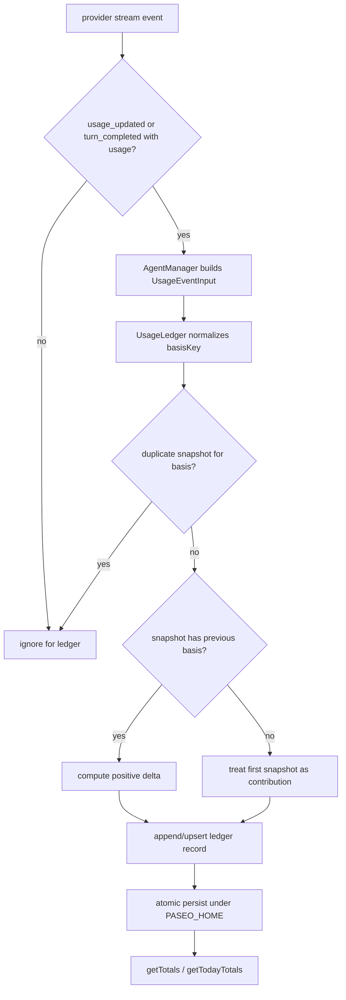

# usage-history-persistence feature design

## 0. 术语约定

| 术语               | 定义                                                                                                                                | 防冲突结论                                                                                                           |
| ------------------ | ----------------------------------------------------------------------------------------------------------------------------------- | -------------------------------------------------------------------------------------------------------------------- |
| `AgentUsage`       | provider stream 里已有的 usage shape，字段包含 `inputTokens`、`cachedInputTokens`、`outputTokens`、`totalCostUsd`、context window。 | 继续复用 `packages/protocol/src/agent-types.ts` / server mirror 类型；不新增第二套 token 字段名。                    |
| Usage contribution | daemon 认为可以累计进 lifetime/today 的一次规范化消耗贡献。                                                                         | 新概念。它不是 `AgentUsage` 原始快照，而是从事件归一化后的 delta。                                                   |
| Usage ledger       | `$PASEO_HOME` 下的持久化 usage contribution 数据源。                                                                                | 新模块，避免把累计事实塞进 `StoredAgentRecord` 或 timeline。                                                         |
| Snapshot basis     | 当 provider 只给累计快照时，ledger 用来计算下一次 delta 的上一份快照基准。                                                          | 新概念。它是去重/差分内部事实，不对 status summary 协议暴露。                                                        |
| Usage turn key     | ledger 用来把同一 turn 内 `usage_updated` 与 `turn_completed` 归到同一 basis 的稳定 key。                                           | 新概念。第一版不能从 provider event 的 optional `turnId` 乐观推导，必须由 `AgentManager` bridge 提供可靠 turn 边界。 |
| Basis scope        | `basisKey` 的语义范围，第一版只允许 `turn`。                                                                                        | 新概念。代码事实表明当前 first-party provider 的 token/cost 快照都是 turn-scoped 累计快照，不能退到 session 合并。   |
| Delta              | 本次新增的可累计 usage 数字。                                                                                                       | 只对 token/cost 字段累计；context window 字段是当前窗口状态，不进入 lifetime/today total。                           |

## 1. 决策与约束

### 需求摘要

本 feature 为全局状态栏 epic 建立最小数据源：daemon 能从 provider 的 `usage_updated` / `turn_completed` 事件记录带 timestamp、可去重的 usage contribution，并在 daemon 重启、跨天、agent archived 后仍能查询 lifetime 和 today totals。

成功标准：

- 同一个 agent 的 usage 事件重复到达时不会重复累计。
- provider 只给累计快照时，ledger 能用 snapshot basis 计算 delta。
- daemon 重启后，从 `$PASEO_HOME` 重新加载 ledger 仍能计算 lifetime/today。
- archived agent 的历史 contribution 仍保留并参与总量。

明确不做：

- 不做 app UI、status bar shell、running session 导航。
- 不定义 `status.summary.*` RPC、client SDK 方法或 `server_info.features.statusSummary`。
- 不做 provider plan usage / quota 拉取，不调用 `provider.usage.list`。
- 不改变 agent lifecycle、archive、tab close、timeline sync 语义。
- 不把 context window 当前值累计进 token total。

### 复杂度档位

走对外发布服务默认档位，并显式标记偏离：

- `Compatibility = backward-compatible`：新增持久化文件和 optional schema，不能破坏旧 agent record 读取。
- `Idempotency = idempotent`：同一 usage 事件重复处理必须得到同样 totals。
- `Determinism = deterministic`：同一组 ledger records 在同一查询窗口下返回稳定 totals。
- `Observability = logged`：ledger 解析失败、丢弃非法 usage、检测到负 delta 时要有可诊断日志。

### 关键决策

1. **新增 `usage-ledger` daemon 模块，而不是扩展 `StoredAgentRecord`**
   - 现状 `StoredAgentRecord` schema 没有 `lastUsage`，并且 agent storage 是 agent 元数据主记录。
   - usage contribution 是时间序列事实，独立持久化更符合 `$PASEO_HOME` file-backed store 模式，也避免 archive/metadata 写入频率被 usage 更新放大。

2. **ledger 记录 delta，另存 snapshot basis**
   - `usage_updated` 可能是中间累计快照，`turn_completed` 可能带最终 usage，也可能缺失 usage。
   - 查询层只聚合 contribution delta；去重和差分发生在写入前，避免每次查询重新理解 provider 事件语义。

3. **today 窗口由 daemon 本地日历日决定**
   - roadmap 已确认第一版不做 per-client timezone。
   - 查询接口接受 optional `now` / clock 以便测试跨天；生产默认 daemon 当前时间。

4. **AgentManager 只做事件桥接**
   - `agent-manager.ts` 已经很胖，当前职责包含 lifecycle、runtime、timeline、attention、archive。
   - 本 feature 只在 usage 事件处理点新增一条调用，把 provider event 和 agent metadata 交给 ledger；计算、持久化、查询留在新模块内。

### 基线风险

- 仓库规则要求变更后运行 `npm run typecheck`、`npm run lint`；若本 checkout 缺依赖导致 `tsgo` / `oxlint` 不存在，implementation/QA 必须记录为环境阻塞而不是改代码绕过。
- 不跑全量测试；目标测试优先为新增 `usage-ledger` 单元测试和少量 agent-manager 桥接测试。

## 2. 名词与编排

### 2.1 名词层

#### 现状

- `AgentUsage` 只是一组 optional 数字字段，定义在 `packages/protocol/src/agent-types.ts`，server 侧 mirror 在 `agent-sdk-types.ts`。
- `AgentStreamEvent` 已有 `usage_updated` 和 `turn_completed`，都可携带 `AgentUsage` 和 optional `turnId`。
- 代码事实上，Codex/Claude 的 usage events 常不携带 `turnId`；Codex `toAgentUsage` 使用 `tokenUsage.last`，Claude result usage 也是单 turn 值。因此 `turnId` optional 不等于可用，跨 turn 合并到 session basis 会错算。
- `agent-manager.ts` 当前处理 `usage_updated` / `turn_completed` 时只执行 `agent.lastUsage = event.usage` 并 emit state；这是 runtime snapshot，不是持久时间序列。
- `agent-storage.ts` 的 `STORED_AGENT_SCHEMA` 当前没有 `lastUsage` 字段；持久 agent record 不能作为 usage 历史来源。
- `agent-projections.ts` 会把 runtime `agent.lastUsage` 投影到 agent payload，但 archived stored agent dispatch 里 `lastUsage` 为 `undefined`。

#### 变化

新增 usage ledger 名词层，核心 shape：

```ts
type UsageLedgerRecord = {
  id: string;
  agentId: string;
  provider: AgentProvider;
  basisScope: "turn";
  usageTurnKey: string;
  sessionId?: string | null;
  workspaceId?: string | null;
  cwd: string;
  model?: string | null;
  turnId?: string | null;
  sourceEventType: "usage_updated" | "turn_completed";
  timestamp: string;
  basisKey: string;
  usage: AgentUsage;
  contribution: UsageTotalsDelta;
};

type UsageSnapshotBasis = {
  basisKey: string;
  basisScope: "turn";
  usageTurnKey: string;
  agentId: string;
  provider: AgentProvider;
  sessionId?: string | null;
  turnId?: string | null;
  lastSnapshot: AgentUsage;
  updatedAt: string;
};

type UsageTotalsDelta = {
  inputTokens?: number;
  cachedInputTokens?: number;
  outputTokens?: number;
  totalCostUsd?: number;
};

type UsageLedgerQuery = {
  from?: string;
  to?: string;
  provider?: AgentProvider;
  workspaceId?: string;
  agentId?: string;
};
```

接口示例：

```ts
// 来源：packages/server/src/server/agent/agent-manager.ts usage event handler
usageLedger.enqueueEvent({
  agentId: agent.id,
  provider: event.provider,
  usageTurnKey,
  sessionId: agent.persistence?.sessionId ?? null,
  workspaceId: agent.workspaceId ?? null,
  cwd: agent.cwd,
  model: agent.runtimeInfo?.model ?? null,
  turnId: event.turnId ?? eventTurnId ?? agent.activeForegroundTurnId ?? null,
  sourceEventType: event.type,
  usage: event.usage,
  observedAt: clock.now(),
});

// 来源：后续 status-summary-protocol feature 会调用的 daemon 内接口
const totals = await usageLedger.getTotals({
  from: startOfDaemonLocalDay(now).toISOString(),
  to: now.toISOString(),
});
```

返回约束：

- `getTotals({})` 返回 lifetime totals。
- `getTotals({ from, to })` 返回窗口 totals，边界采用 `[from, to)`。
- 缺失字段不按 0 展示，但求和时可把缺失视为“不增加该字段”；结果对象只包含至少出现过的字段。
- `usage_updated` 与同一 turn 的 `turn_completed` 共用 `basisKey`。例如 Codex 当前会在 `thread/tokenUsage/updated` 后用同一 `latestUsage` 发出 `turn_completed`；最终快照相同时必须被识别为同一 basis 的零 delta，而不是按 event type 重复累计。

Usage turn key / basisKey 规则（实现前硬约束）：

| Provider / event source    | 第一版 `basisScope` | `usageTurnKey` 来源                                                                                                                                               | basisKey 组成                       | 首快照规则                                                                                            | 证据                                                                                                                  |
| -------------------------- | ------------------- | ----------------------------------------------------------------------------------------------------------------------------------------------------------------- | ----------------------------------- | ----------------------------------------------------------------------------------------------------- | --------------------------------------------------------------------------------------------------------------------- |
| Codex app-server           | `turn`              | bridge 优先用 `event.turnId ?? eventTurnId ?? agent.activeForegroundTurnId`；若仍为空，使用 bridge 维护的 per-agent `usageTurnSequence`，在 terminal event 后清空 | `agentId + provider + usageTurnKey` | 每个 turn 第一份可累计 token 快照作为 contribution；同 turn 后续只计正向 delta                        | Codex usage events 实践中不带 `turnId`；`toAgentUsage` 取 `tokenUsage.last`，并且 `turn_completed` 复用 `latestUsage` |
| OpenCode                   | `turn`              | 同 Codex                                                                                                                                                          | `agentId + provider + usageTurnKey` | 每个 turn 第一份可累计快照作为 contribution；同 turn 后续只计正向 delta                               | `opencode-agent.ts` 维护 per-turn `accumulatedUsage`，turn 完成后重置                                                 |
| Claude                     | `turn`              | 同 Codex；常见路径应命中 `agent.activeForegroundTurnId`                                                                                                           | `agentId + provider + usageTurnKey` | 每个 turn 第一份可累计 token/cost 快照作为 contribution；只有 context window 字段时 contribution 为空 | `ClaudeContextUsageState.beginTurn()` 每 turn 重置请求 usage；部分 `usage_updated` 只含 context window                |
| ACP / Copilot / custom ACP | `turn`              | 同 Codex                                                                                                                                                          | `agentId + provider + usageTurnKey` | 每个 turn 第一份可累计快照作为 contribution                                                           | `acp-agent.ts` 使用 `currentTurnUsage` 并在 turn terminal event 带出                                                  |
| Pi / OMP                   | `turn`              | 同 Codex                                                                                                                                                          | `agentId + provider + usageTurnKey` | 每个 turn 第一份可累计快照作为 contribution                                                           | `pi/agent.ts` 从 stats 转 `AgentUsage` 并在 turn 相关路径上报                                                         |
| Mock / tests               | `turn`              | fixture 显式声明或使用 bridge turn key                                                                                                                            | `agentId + provider + usageTurnKey` | 用于覆盖缺 provider turnId、同快照跨事件、乱序和跨 turn 复位                                          | mock provider 已有 `usage_updated` / `turn_completed` 测试入口                                                        |

Negative delta / stale 判据：

- 新 `usageTurnKey` 表示新 turn，不与上一 turn 比较，因此 per-turn 重置不是 negative delta。
- 同一 turn 内若某字段小于 basis，视为 stale/reorder，不写 contribution，也不刷新 basis。
- 第一版不做“按比例猜 reset”，也不做 session-level fallback。若 bridge 无法提供可靠 turn 边界，则创建一次性的 per-agent `usageTurnSequence`，在 terminal event 后清空；仍无法绑定 terminal event 时，记录 warn 并宁可不跨 turn 合并。
- basis 和 record id 都不包含 `sourceEventType`；同一 basis 下 canonical usage snapshot 相同就是同一事实。
- canonical snapshot 用固定字段顺序序列化：`inputTokens`、`cachedInputTokens`、`outputTokens`、`totalCostUsd`；仅包含 finite number 字段，缺失字段省略，context window 字段不参与 record id。
- 关键假设：同一 provider 内 token 与 cost 使用相同 turn 边界；若未来出现 session-cumulative cost + turn-scoped token 的 provider，必须扩展 basis scope 或拆字段 basis。

#### Interface 设计检查

- Module / interface：新增 `UsageLedger` deep module，外部只看到 `enqueueEvent`、`getTotals`、`getTodayTotals`、`initialize`、`flush`、`deleteAgentUsage`。
- Interface facts：caller 只传入 provider/session/turn metadata 和 bridge 派生的 `usageTurnKey`；ledger 用 turn-scoped basis 负责去重、差分、持久化、窗口计算。
- Seam placement：生产 store 是 `$PASEO_HOME` JSON 文件；测试可用临时目录和可注入 clock，不需要 mock 文件系统。
- Depth / locality：复杂度集中在 ledger 内部；`AgentManager` 只提供 agent metadata 和 raw usage event。
- Dependency category：in-process module dependency。
- Adapter 结论：需要一个轻量 store/clock port，生产和测试分别接真实文件系统/固定 clock；不需要网络或 provider adapter。

### 2.2 编排层



#### 现状

- Agent stream events 进入 `AgentManager.dispatchStreamEventByType`。
- `usage_updated` 立即覆盖 `agent.lastUsage` 并 emit state。
- `turn_completed` 通过 `onStreamTurnCompleted` 覆盖 `agent.lastUsage`，再处理 lifecycle idle / runtime refresh。
- 持久 timeline 不天然保存 `usage_updated`，agent record 也不保存 `lastUsage`，所以 daemon 重启后无法重建 today/lifetime usage。

#### 变化

- 在两个 usage 事件处理点插入同一条非阻塞 ledger 写入路径：
  - `usage_updated`：继续更新 `agent.lastUsage`，同时调用 ledger。
  - `turn_completed`：只有 `event.usage` 存在时调用 ledger；缺失 usage 不生成空 contribution。
- bridge 先派生 `usageTurnKey`，再调用 `usageLedger.enqueueEvent(...)`；不得在 `dispatchStreamEventByType` 热路径 `await` 文件 I/O。
- `turn_completed` 处理时依赖 `agent.activeForegroundTurnId` 尚未被 `finalizeForegroundTurn` 清空的现有时序；实现必须用测试锁住“同 turn 的前序 `usage_updated` 与 `turn_completed` 得到同一 basisKey”。
- ledger 用 `usageTurnKey` 生成 `basisKey`；同一 basis 内只累计正向 delta。
- ledger 写入采用队列串行化，避免同一 agent 快速 usage 更新造成并发写文件互相覆盖。
- ledger 查询不依赖 live agents。archived agent 的 contribution 已在独立文件里，因此 archive 不删除历史 usage。
- 查询成本第一版接受 O(ledger 全历史) 的全量加载/内存聚合，因为状态栏 v1 只需要 host 级轻量 summary，且 `$PASEO_HOME/usage-ledger/{agentId}.json` 便于按 agent 清理和测试。实现必须把聚合逻辑集中在 ledger 内部；若目标测试或手工 fixture 显示全量扫描已明显变慢，再另起 feature 做 daily/provider/model rollup 缓存。
- daemon bootstrap 初始化 usage ledger store；后续 status summary service 只读 ledger 聚合，不直接扫 provider events。

#### 流程级约束

- 错误语义：usage ledger 写入失败不得打断 agent lifecycle 或 stream dispatch；必须记录 error 日志，并让后续 status summary 看到“缺数据”而不是杀掉 agent。
- 幂等性：`basisKey` 由 `usageTurnKey` 决定，不包含 `sourceEventType`；record id 由 `basisKey + canonical usage snapshot` 稳定派生。同一 basis 里 `usage_updated` 与 `turn_completed` 的相同最终快照不追加第二条。
- 顺序约束：同一 `basisKey` 的 snapshot basis 只在正向 delta 或相同快照时更新；旧快照晚到或字段回退时不产生 contribution，也不向下刷新 basis。
- 时间窗口：production 使用 daemon clock；测试可注入 fixed clock，跨天场景不靠真实时间等待。
- 可观测点：记录 invalid usage、negative/reset delta、persist failure、load parse failure；不输出完整 prompt 或敏感 transcript。

### 2.3 挂载点清单

- `$PASEO_HOME/usage-ledger/{agentId}.json`：新增 file-backed store，保存单 agent ledger records 和 snapshot bases。
- `packages/server/src/server/usage-ledger/`：新增 daemon deep module。
- `packages/server/src/server/bootstrap.ts`：新增 `UsageLedger` 初始化并注入 `AgentManager`。
- `packages/server/src/server/agent/agent-manager.ts` usage event bridge：新增对 ledger 的非阻塞 enqueue 调用。
- `docs/data-model.md`：新增 Usage Ledger 持久化结构说明。

### 2.4 推进策略

1. 名词骨架：建立 `UsageLedger` 接口、record/schema、固定 clock 查询窗口。
   退出信号：单元测试可构造空 ledger 并查询空 totals。
2. turn boundary 和 delta：实现 bridge `usageTurnKey`、basisKey 生成、canonical snapshot、正向 delta、重复/同快照事件跳过。
   退出信号：Codex/OpenCode/Claude 缺 event turnId 的多 turn fixture、同快照跨事件、stale 回退四类测试通过。
3. 文件持久化：接入 `$PASEO_HOME/usage-ledger/{agentId}.json`、Zod parse、atomic write、bootstrap load。
   退出信号：写入后新实例加载仍返回同样 lifetime/today totals。
4. AgentManager 桥接：把 `usage_updated` / `turn_completed` 输入 ledger，保持现有 `lastUsage` 和 lifecycle 行为。
   退出信号：目标 agent-manager 测试证明 usage 被记录且 turn completion 状态不变。
5. 查询覆盖：补齐 lifetime/today、跨天、archived agent、missing fields、cost optional、per-provider fixture 的行为证据。
   退出信号：验收矩阵核心场景都有测试或 diff review 证据。
6. 文档与验证：更新 `docs/data-model.md`，运行目标测试、typecheck、lint。
   退出信号：命令输出或环境阻塞记录齐全，文档描述和 schema 一致。

### 2.5 结构健康度与微重构

##### 评估

- 文件级 `packages/server/src/server/agent/agent-manager.ts`：约 3884 行，职责已经覆盖 lifecycle、stream、timeline、archive、runtime refresh；本 feature 只应加 bridge，不继续塞计算逻辑。
- 文件级 `packages/server/src/server/agent/agent-storage.ts`：约 369 行，是 agent record store；本 feature 不把 usage history 放入该 schema，避免职责扩大。
- 文件级 `packages/server/src/server/atomic-file.ts`：约 25 行，可复用 atomic write helper，无需改结构。
- 目录级 `packages/server/src/server/agent/`：已有 provider、tools、rewind 等子目录，usage ledger 不是 agent provider 内部能力，不适合放这里。
- 目录级 `packages/server/src/server/`：同层文件较多，但也已有按领域建目录的模式，如 `schedule/`、`chat/`、`managed-processes/`、`session/`。
- compound 检索：`.codestable/compound/` 目前没有相关目录/命名 convention。

##### 结论：不做微重构

理由：本 feature 可通过新增 `packages/server/src/server/usage-ledger/` deep module 避免扩大胖文件；`agent-manager.ts` 只新增 bridge。当前没有“只搬不改行为”的必要前置重构。

##### 超出范围的观察

- `agent-manager.ts` 长期偏胖，但拆 lifecycle/timeline/runtime 语义会改变模块边界，不属于本 feature 的只搬不改行为。后续如要处理，应另走 `cs-refactor`。

## 3. 验收契约

### 3.1 关键场景清单

- 正常：连续收到同一 turn 的递增 `usage_updated` 快照 → lifetime/today 只累计正向增量。
- 正常：Codex/OpenCode/Claude 这类实践中不带 event `turnId` 的 provider，连续两个 turn 的复位快照 → 依靠 `agent.activeForegroundTurnId` 或 bridge `usageTurnSequence` 分成两个 turn basis，并正确累加。
- 正常：ACP/Pi 这类 turn-scoped provider 每个 turn 重置上报 → 每个 turn 独立计入该 turn 的 usage，不被上一 turn 的大 basis 当作 negative delta 丢弃。
- 正常：`turn_completed` 带最终 usage，且已处理过同一 basis 的相同最终快照 → 不重复累计，即使前一事件类型是 `usage_updated`。
- 正常：daemon 写入 ledger 后重启 → 新 `UsageLedger` 实例从 `$PASEO_HOME` 加载并返回相同 totals。
- 边界：跨 daemon 本地日历日写入两条 contribution → today 只包含当前日窗口，lifetime 包含两天。
- 边界：agent archived 后不删除 ledger 文件 → archived agent 的历史 contribution 仍进入 lifetime/today 查询。
- 边界：usage 字段部分缺失 → totals 只包含出现过的数字字段，不把缺失展示为 0。
- 错误：provider snapshot 数字回退或乱序旧快照 → 不写负 contribution，也不向下刷新 basis；只有明确新 session/turn 边界才创建新 basis。
- 错误：usage ledger 文件损坏或 schema 不合法 → daemon 记录错误并跳过坏文件，不阻塞 agent lifecycle。
- 清理：agent archive 不删除 ledger；agent hard delete 可删除对应 `{agentId}.json`，但 host lifetime 统计是否保留 deleted agent 贡献留给后续产品决策，第一版实现 `deleteAgentUsage(agentId)` 作为可卸载/清理入口，不从 archive 调用。

### 3.2 明确不做的反向核对项

- diff 中不应出现 `status.summary.get.request`、`status.summary.updated`、`server_info.features.statusSummary` 的实现。
- diff 中不应出现 app UI、Expo route、status bar component 的改动。
- diff 中不应调用 `provider.usage.list` 或 quota fetcher。
- diff 中不应改变 archive cascade、tab close 或 lifecycle state transition 语义。
- totals 代码不应把 `contextWindowMaxTokens` / `contextWindowUsedTokens` 加进 lifetime/today token totals。

### 3.3 Acceptance Coverage Matrix

| Scenario                                                                        | Covered By Step | Evidence Type      | Command / Action                                                                                              | Core?                   |
| ------------------------------------------------------------------------------- | --------------- | ------------------ | ------------------------------------------------------------------------------------------------------------- | ----------------------- | ---------------------------------------------------------- | --- |
| Codex/OpenCode/Claude 缺 event turnId 的多 turn fixture 仍按 turn 正确累计      | S2 / S5         | test               | `npx vitest run packages/server/src/server/usage-ledger/usage-ledger.test.ts --bail=1`                        | yes                     |
| ACP/Pi turn-scoped fixture 每 turn 重置仍正确累计                               | S2 / S5         | test               | 同上                                                                                                          | yes                     |
| 重复 usage event 幂等，且 usage_updated / turn_completed 同快照不重复           | S2              | test               | 同上                                                                                                          | yes                     |
| daemon 重启后 totals 不变                                                       | S3              | test               | 同上                                                                                                          | yes                     |
| 跨天 today/lifetime 窗口正确                                                    | S5              | test               | 同上                                                                                                          | yes                     |
| archived agent history 仍参与 totals                                            | S5              | test / diff review | ledger 查询不依赖 active agent list                                                                           | yes                     |
| hard delete 有 ledger 清理入口，archive 不触发清理                              | S3 / S4         | test / diff review | ledger API + agent delete/archive path review                                                                 | yes                     |
| AgentManager bridge 非阻塞且 usage_updated / turn_completed 共用同一 turn basis | S4              | test               | `npx vitest run packages/server/src/server/agent/agent-manager.test.ts --bail=1 -t "usage ledger"` 的目标用例 | yes                     |
| data model 文档同步                                                             | S6              | diff review        | 检查 `docs/data-model.md`                                                                                     | yes                     |
| 不实现 status summary RPC/UI/provider quota                                     | S6              | diff review / grep | `rg "status\\.summary                                                                                         | provider\\.usage\\.list | StatusBar" packages/server packages/app packages/protocol` | no  |

### 3.4 DoD Contract

| ID             | 要求                                                                                                    | 证据                        | 阻塞级别 |
| -------------- | ------------------------------------------------------------------------------------------------------- | --------------------------- | -------- |
| DOD-DESIGN-001 | design 和 checklist 覆盖 roadmap item 的跨天/重启/archived 三情形，并覆盖 provider merge semantics 风险 | design review               | blocking |
| DOD-IMPL-001   | checklist steps 全部完成，usage ledger schema、store、bridge、docs 均落盘                               | checklist / diff / evidence | blocking |
| DOD-REVIEW-001 | code review passed 且无 unresolved blocking                                                             | review report               | blocking |
| DOD-QA-001     | QA 跑过目标测试、typecheck、lint，或记录环境阻塞                                                        | QA report                   | blocking |
| DOD-ACCEPT-001 | acceptance 核对 roadmap item、docs/data-model 和反向不做项                                              | acceptance report           | blocking |

Validation Commands:

| ID      | 命令                                                                                               | 目的                                                          | 核心性     | 失败处理                    |
| ------- | -------------------------------------------------------------------------------------------------- | ------------------------------------------------------------- | ---------- | --------------------------- |
| CMD-001 | `npx vitest run packages/server/src/server/usage-ledger/usage-ledger.test.ts --bail=1`             | 验证 ledger 去重、delta、持久化和窗口查询                     | core       | fix-or-block                |
| CMD-002 | `npx vitest run packages/server/src/server/agent/agent-manager.test.ts --bail=1 -t "usage ledger"` | 验证 usage bridge 不破坏 agent lifecycle 且同 turn basis 一致 | core       | fix-or-block                |
| CMD-003 | `npm run typecheck`                                                                                | 仓库类型检查                                                  | core       | fix-or-block 或记录环境阻塞 |
| CMD-004 | `npm run lint`                                                                                     | 仓库 lint                                                     | core       | fix-or-block 或记录环境阻塞 |
| CMD-005 | `npm run format:check`                                                                             | 格式检查                                                      | supporting | fix-or-block                |

Required Artifacts：design-review、implementation evidence、code review、QA、acceptance、`docs/data-model.md` 更新。

## 4. 与项目级架构文档的关系

- `docs/data-model.md` 必须新增 Usage Ledger 持久化路径、schema 摘要、atomic write 说明和无 migration 兼容策略。
- `docs/architecture.md` 可在后续 `status-summary-protocol` feature 中补 status summary 数据流；本 feature 只落 usage ledger，不强制更新系统 overview。
- `docs/providers.md` 不需要改 provider plan usage 章节，因为本 feature 不触碰 quota fetcher；若实现中确认 provider usage event 语义差异明显，可在 acceptance 后建议沉淀到新文档或 compound。
