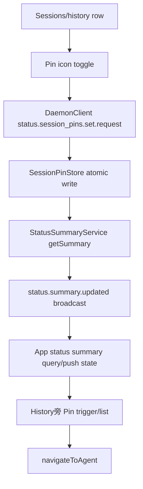

# status-bar-session-pins feature design

## 0. 术语约定

| 术语                  | 定义                                                                           | 防冲突结论                                                                |
| --------------------- | ------------------------------------------------------------------------------ | ------------------------------------------------------------------------- |
| Session pin           | 某个 host 上固定的 agent/session 快捷入口。                                    | UI 可称 `Pin`；归属 host/daemon，不是 app 本地缓存。                      |
| Pinned session list   | 状态栏历史旁新增的 Pin 入口展开后的列表。                                      | 是快速返回固定对话的入口，不是完整历史页，也不是 workspace tab launcher。 |
| Pinned session target | host 持久化的 agent 目标，至少包含 `agentId` 和可选 `workspaceId` / 展示快照。 | 不含 `serverId`；serverId 来自当前连接的 host。                           |

## 1. 决策与约束

### 需求摘要

用户希望在状态栏的会话列表和历史列表中，把某个会话固定起来；Pin 状态应像 status bar 统计一样跟随 host，而不是跟随某个 app 客户端缓存。后续任意连接到该 host 的客户端都能从状态栏历史旁的 `Pin` 入口打开固定列表，并快速进入对应对话。

成功标准：

- 状态栏 running/attention/recent 会话列表每行能固定或取消固定该会话。
- 状态栏历史列表每行能固定或取消固定该历史会话。
- Pin 状态由 daemon 持久化到 `$PASEO_HOME`，同一 host 的不同 app 客户端看到一致结果。
- `status.summary.get.response` / `status.summary.updated` 携带 pinned sessions，和 usage/activity 一起成为 host summary 的一部分。
- 历史入口旁新增 `Pin` 入口；点开后显示当前 host 的固定会话列表。
- 已固定但当前 live/history 数据中暂时找不到详情的目标仍能显示保底行，并尝试按 `agentId` 导航。

明确不做：

- 不把 Pin 放进 app AsyncStorage；app 只渲染 host 返回的状态。
- 不把 Pin 写入 agent record；Pin 不改变 agent 生命周期，也不阻止归档。
- 不实现跨 host 同步；每个 host/daemon 独立持久化自己的 pinned sessions。
- 不新增完整搜索、排序或批量管理页面。
- 不新增旧 daemon fallback 模拟逻辑；旧 host 不支持该 capability 时，Pin 功能不可用或提示更新 host。

### 复杂度档位

- `State = host-persisted preference`：daemon 新增文件型 store，使用原子写。
- `Protocol = additive + capability-gated`：summary 新增可选字段，mutation 新增 dotted RPC，并在 `server_info.features.*` 暴露能力。
- `Interaction = cross-platform row action + anchored/sheet list`：desktop 使用现有 DropdownMenu，compact 使用 AdaptiveModalSheet。
- `Routing = existing helper only`：固定列表点击只走 `navigateToAgent` 或状态栏历史已有 refresh+navigate 路径。

### 关键决策

1. **Pin 跟随 host，不跟随 app 缓存**
   - 新增 daemon 侧 `SessionPinStore`，持久化到 `$PASEO_HOME/status-summary/session-pins.json` 或同等 host-owned 路径。
   - store 读写使用 Zod 校验和 `writeJsonFileAtomic`；损坏文件记录日志并回退为空列表，不阻塞 daemon 启动。
   - app 不再复用 `workspace-pins` AsyncStorage store；该 store 继续只负责 workspace tab launcher。

2. **Summary 携带 pinned sessions，mutation 通过新 RPC**
   - `HostStatusSummaryPayloadSchema` 新增 `pinnedSessions?: StatusPinnedSession[]`，旧客户端/旧 daemon 解析保持兼容。
   - 新 RPC 使用 dotted namespace：
     - `status.session_pins.set.request`
     - `status.session_pins.set.response`
   - 请求参数包含 `agentId`、`pinned`、可选 `workspaceId/title/provider/updatedAt` 快照。
   - mutation 成功后 daemon 写 store，并触发 `status.summary.updated` 广播，让所有连接客户端刷新同一 host 状态。

3. **Feature capability 是使用 Pin 的入口门**
   - `server_info.features.statusBarSessionPins` 标识 host 支持该功能。
   - `// COMPAT(statusBarSessionPins): added in v0.1.X, drop the gate when floor >= v0.1.X` 放在 app 读取该能力的单一 cleanup site。
   - 下游 UI 读取一个干净的 `canUseStatusBarSessionPins`，不在每个 row 里散落旧 host 判断。

4. **会话行内 Pin 是稳定 trailing icon button**
   - running sessions 的 `StatusBarSessionRow` 和 history 的 `StatusBarHistoryRow` 都在 row trailing 区域显示 Pin/Unpin icon。
   - desktop 可在 hover 时显眼，native/compact 必须始终可见或有稳定 hit area，不能依赖 hover。
   - Pin toggle 必须 `stopPropagation`，不能触发行主导航。

5. **Pin 目标是 agent identity，不是列表行快照**
   - key 使用 `agentId`，同一 host 内同一 agent 在 running/history 两处只能有一个 pin。
   - `workspaceId` 是导航 hint；缺失时仍允许 agent 导航，不能从 `cwd` 推导 workspace ownership。
   - 展示快照用于 stale fallback；最新 live/history 数据可覆盖 summary 展示，但不改变 identity。

### Top 3 风险与缓解

1. **协议/能力门做散导致旧 host 行为不一致**
   - 缓解：server_info feature flag 单点归一；旧 host 不显示可操作 Pin；summary 字段 optional，mutation 只在 capability 存在时调用。
2. **Pin mutation 后多客户端状态不同步**
   - 缓解：mutation 写 store 后触发 `status.summary.updated`；app 复用 status summary push/query 现有路径更新 UI。
3. **历史数据缺失导致 pinned list 不可用**
   - 缓解：host store 保存最小展示快照；解析不到详情时仍显示 fallback 行并按 agentId 导航。

### 非显然依赖与关键假设

- Pin 是 per-host 偏好：同一个 daemon 下多客户端一致，不跨不同 host 同步。
- 固定的是 agent/session 对话，不是 workspace、provider profile 或 terminal。
- 依赖现有 `StatusSummaryService.getSummary()` 作为 host summary 聚合点。
- 依赖 `navigateToAgent` 继续作为进入 agent detail 的唯一 route helper。

## 2. 名词与编排

### 2.1 名词层

#### 现状

- `packages/server/src/server/status-summary/status-summary-service.ts` 动态生成 usage/activity summary，没有持久化 UI 偏好。
- `packages/protocol/src/messages.ts` 中 `HostStatusSummaryPayloadSchema` 只包含 `generatedAt`、`usage`、`activity`。
- `packages/client/src/daemon-client.ts` 已有 `getStatusSummary()` 调 `status.summary.get.request`。
- `packages/app/src/status-summary/*` 通过 query/push/view-model 渲染 host status bar。
- `packages/app/src/workspace-pins/*` 是 app-local workspace tab launcher pin，不应承载 host session pin。

#### 变化

新增 host pin 类型：

```ts
type StatusPinnedSession = {
  agentId: string;
  workspaceId?: string | null;
  title?: string | null;
  provider?: string | null;
  updatedAt?: string | null;
  pinnedAt: string;
};
```

新增 RPC：

```ts
type StatusSessionPinsSetRequest = {
  type: "status.session_pins.set.request";
  requestId: string;
  agentId: string;
  pinned: boolean;
  workspaceId?: string | null;
  title?: string | null;
  provider?: string | null;
  updatedAt?: string | null;
};

type StatusSessionPinsSetResponse = {
  type: "status.session_pins.set.response";
  payload: {
    requestId: string;
    pinnedSessions: StatusPinnedSession[];
  };
};
```

新增/扩展职责：

- `SessionPinStore`：daemon 文件型 store，提供 `list()` / `setPinned(input)`。
- `StatusSummaryService`：读取 pin store，把 `pinnedSessions` 放入 summary；提供或委托 mutation 后的 summary 广播。
- `Session`：分发 `status.session_pins.set.request`，返回 response 并触发 summary update。
- `DaemonClient`：新增 `setStatusSessionPin(...)`。
- `status-summary/status-bar-session-pins.tsx`：构建 row target、渲染 Pin trigger/list、调用 daemon client mutation。

### 2.2 编排层



#### 现状

- status summary 是 host 侧数据源，但没有 mutation RPC。
- sessions/history row 只支持打开 agent/workspace。
- app-local `workspace-pins` 与 status summary 无连接。

#### 变化

- daemon bootstrap 创建 `SessionPinStore`，注入 `StatusSummaryService` / `Session` 所需依赖。
- `getSummary()` 在 usage/activity 之外返回 `pinnedSessions`。
- row toggle 调 client mutation；mutation 成功前可用 row pending state 或禁用重复点击，最终以 summary push 为权威状态。
- Pin list 从 summary 的 `pinnedSessions` 渲染，并可用 live/history 数据补展示。
- 点击 pinned row 关闭 panel/sheet，再调用集中导航函数。

#### 流程级约束

- WebSocket schemas 保持结构纯声明，不用 `.transform()` / `.preprocess()`。
- `pinnedSessions` 在 summary 中是 optional additive field；新 daemon 可发送，旧 daemon 不发送。
- set RPC 是新 feature 行为，必须 capability-gated；不要用旧 RPC 拼 fallback。
- mutation 幂等：设置已 pinned 或已 unpinned 都成功返回当前列表。
- 同一 host 内按 `agentId` 去重；不能从 `cwd` 推导 workspace ownership。
- Toggle 不触发 agent refresh、archive、stop、delete 等生命周期操作。
- Pinned list 不直接 import Expo Router，不手拼 route。

### 2.3 挂载点清单

- `packages/protocol/src/messages.ts`：新增 pinned session schema、summary optional field、set request/response。
- `packages/server/src/server/status-summary/`：新增 session pin store，并让 `StatusSummaryService` 聚合 pinned sessions。
- `packages/server/src/server/session.ts`：处理 `status.session_pins.set.request` 并广播 summary update。
- `packages/client/src/daemon-client.ts`：新增 `setStatusSessionPin`。
- `packages/app/src/status-summary/`：summary view/query 消费 pinned sessions；sessions/history row 接入 Pin toggle；History 旁新增 Pin trigger/list。
- `packages/app/src/utils/server-info-*` 或等价单点：解析 `server_info.features.statusBarSessionPins`。
- `docs/data-model.md`：记录 `$PASEO_HOME/status-summary/session-pins.json` 的路径、schema 归属、原子写与损坏文件回退语义。

### 2.4 推进策略

1. 协议、host store 与数据模型文档：新增 `StatusPinnedSession` schema、summary optional field、set RPC schema、daemon pin store、单测，并更新 `docs/data-model.md`。
   退出信号：协议测试/daemon store 单测覆盖旧 payload 兼容、set/unset 幂等、原子持久化和损坏文件回退；数据模型文档记录新 store 路径与行为。
2. Server/client RPC 与 daemon bootstrap 接线：Session 分发 set request，DaemonClient 暴露方法，daemon bootstrap 创建同一个 `SessionPinStore` 并注入 summary 聚合与 mutation 处理链路，mutation 后广播 summary update。
   退出信号：server/session 或构造测试证明真实 daemon wiring 使用同一 store，set 响应返回当前 pinnedSessions，另一客户端可通过 summary update 看到变化。
3. Server feature flag、App capability 与 summary consumption：server_info payload 暴露 `features.statusBarSessionPins: true`；app 单点解析 feature flag；status summary view model 暴露 pinned sessions。
   退出信号：server_info schema/payload 测试覆盖 feature flag；旧 host 下不显示可操作 Pin，新 host 下 rows/list 读取同一 summary pinned state。
4. Sessions/history row toggle：两类 row 增加固定尺寸 Pin icon，toggle 调 host mutation，不触发行导航。
   退出信号：组件测试覆盖 pin/unpin、pending/失败处理、stop propagation、native/compact 可见性。
5. Pinned session list entry：History 旁新增 Pin 入口，desktop DropdownMenu / compact AdaptiveModalSheet 渲染 pinned rows 和 stale fallback。
   退出信号：组件测试覆盖有 pin 显示入口、无 pin 隐藏或空态、route/server 切换关闭、缺 workspaceId 仍导航。
6. 范围守护与验证：运行目标测试、typecheck、lint、format check 和 scope grep。
   退出信号：无 app-local AsyncStorage session pin、无 agent lifecycle mutation、无直接 router；命令通过或记录环境阻塞。

### 2.5 结构健康度与微重构

#### 评估

- `status-bar-running-sessions.tsx` 已包含 trigger、list、row 和 history 逻辑，继续塞 pinned list 会进一步变胖。
- `status-summary/` 目录是状态栏 UI 与 daemon summary 的自然归属，适合新增 session pin UI 文件。
- server 侧 status summary 当前只有 service 文件；pin store 是独立持久化职责，应放同目录新文件，而不是塞进 service。
- `workspace-pins/` 是 app-local workspace tab launcher 域；本 feature 不应扩展该目录。

#### 结论：做局部结构隔离，不做行为等价微重构

新增 server store 放入 `server/status-summary/` 独立文件；新增 app pinned list UI 放入 `app/status-summary/status-bar-session-pins.tsx` 或等价新文件。既有 sessions/history 代码只做必要挂载，不进行大文件搬迁。

## 3. 验收契约

### 3.1 关键场景清单

- 正常：客户端 A 在 running sessions 列表点击某行 Pin icon → host 写入 pinned session，客户端 A/B 都通过 summary update 看到 pinned 状态。
- 正常：客户端在 history 列表点击某行 Pin icon → daemon 重启后 `status.summary.get.response` 仍返回该 pinned session。
- 正常：History 旁出现 Pin 入口 → 点开显示固定会话列表，点击条目进入对应 agent。
- 正常：同一个 agent 在 sessions 与 history 同时出现 → host 内只产生一个 pinned target，再点任一处取消固定。
- 边界：pinned target 当前不在 live/history 数据中 → Pin 列表显示 fallback 行，点击仍尝试进入 agent。
- 边界：旧 host 没有 capability → app 不显示可操作 Pin，不调用 set RPC。
- 反向核对：git diff 不包含 app AsyncStorage session pin；不包含 archive/stop/delete/cancel agent 调用。

### 3.2 Acceptance Coverage Matrix

| 场景                                   | Checklist | 证据类型                    |
| -------------------------------------- | --------- | --------------------------- |
| 协议兼容与 host store                  | S1        | unit test                   |
| set RPC 与 summary broadcast           | S2        | server/client test          |
| capability gate 与 summary consumption | S3        | unit/component test         |
| sessions/history 行内 toggle           | S4        | component test              |
| Pin 入口、fallback 与导航              | S5        | component test / screenshot |
| 范围不越界                             | S6        | grep / diff review          |

### 3.3 DoD Contract

- 必跑：
  - `npx vitest run packages/protocol/tests/messages.test.ts --bail=1` 或新增的 protocol message 测试文件
  - `npx vitest run packages/server/src/server/status-summary/session-pin-store.test.ts --bail=1`
  - `npx vitest run packages/server/src/server/session.test.ts --bail=1`
  - `npx vitest run packages/client/src/daemon-client.test.ts --bail=1`
  - `npx vitest run packages/app/src/status-summary/status-bar-running-sessions.test.tsx --bail=1`
  - `npm run typecheck`
  - `npm run lint`
  - `npm run format:check`
- 范围 grep：
  - `! rg "AsyncStorage|pinned-tab-targets|usePinnedTargetsStore" packages/app/src/status-summary`
  - `! rg "router\\.|buildHostAgentDetailRoute|buildHostWorkspaceRoute|archiveAgent|cancelAgent|deleteAgent|stopAgent" packages/app/src/status-summary packages/server/src/server/status-summary`
  - `! rg "COMPAT\\(statusBarSessionPins\\).*v0\\.1\\.X" packages/app/src packages/server/src packages/protocol/src`

### 3.4 交付物清单

- 新增协议 schema / 类型 / client RPC。
- daemon host-owned session pin store。
- status summary payload 中的 pinned sessions 聚合与 mutation 后广播。
- `server_info.features.statusBarSessionPins` 服务端能力暴露与 app 单点消费。
- app capability gate、row Pin toggle、History 旁 Pin trigger/list。
- `docs/data-model.md` 新增 session pin store 说明。
- 单元/组件测试覆盖目标场景。

### 3.5 清洁度规则

- 不新增临时日志、TODO、注释掉代码。
- 不新增手写 SVG；Pin 图标使用 lucide icon。
- 不新增 `useUnistyles()`；样式沿用项目 StyleSheet / withUnistyles 模式。
- WebSocket schema 不使用 transform/preprocess/catch。
- 不手动格式化，提交前由 `npm run format` 处理。

## 4. 自我批判结论

- 可证伪性：核心归属从 app-local 改成 host-owned 后，验收可通过 daemon 重启、多客户端 summary update、scope grep 判断。
- 步骤原子性：协议/store、server/client RPC、app capability、row toggle、Pin list 分离，避免 UI 先行掩盖 host 状态问题。
- 最弱依赖：mutation 后 summary broadcast 是一致性关键，已提前放入 S2 验证。
- 证据完整性：需要 server/client/app 三层目标测试，不能只靠组件测试。
- 接口深度：summary 直接携带 pinned sessions，app 不需要另行 fan-out list RPC；set RPC 返回当前列表便于命令式调用确认。
