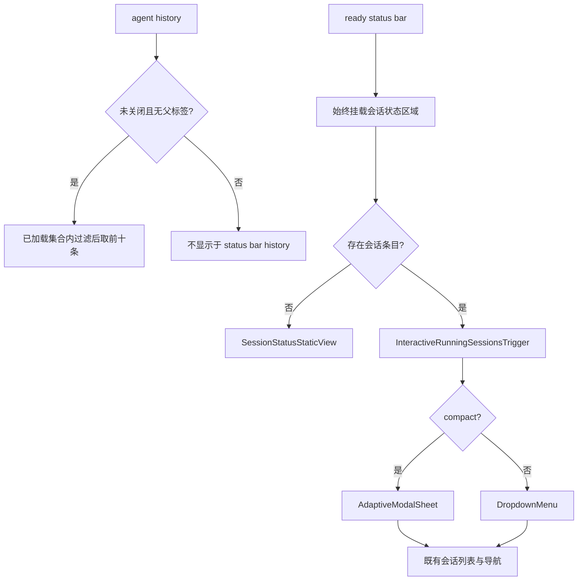

# Status bar 历史与会话状态 UI feature design

## 0. 术语约定

| 术语             | 定义                                                                      | 防冲突结论                                                  |
| ---------------- | ------------------------------------------------------------------------- | ----------------------------------------------------------- |
| 历史可见会话     | 状态栏历史中可重新打开的根 agent：未关闭且不带有效父 agent 标签。         | 不是 archive 语义；`closed` 是 lifecycle 状态。             |
| 子 agent         | 带 `paseo.parent-agent-id` 标签的 delegated agent。                       | 判断复用 `getParentAgentIdFromLabels`，不硬编码标签值。     |
| 会话状态触发器   | status bar 中呈现 running/attention 数量、并在有会话时打开详情的既有 UI。 | 仅活跃时是交互组件。                                        |
| 会话状态静态视图 | 空闲时复用会话状态触发器的标签、图标、尺寸和 running 0 内容。             | 它是 `View + TriggerContent`，不是 button、trigger 或入口。 |
| 空闲状态         | running、needs attention 和 recent 快照均为空。                           | 空闲不再退回为独立的“运行中 0 / 需要注意 0” primary chips。 |

## 1. 决策与约束

### 需求摘要

状态栏 history 不展示已关闭或子 agent，并在过滤后取十条。状态栏的会话状态在空闲和活跃时使用同一种视觉结构：始终显示既有会话状态入口；有会话时可打开详情，无会话时显示零运行数但不产生不可达的空面板。errors 保留现有静态计数，不增强可点击能力。

成功标准：

- history 不出现 `status: "closed"` 或带有效父 agent 标签的条目；过滤项不占十条上限。
- status bar 不再根据是否有 session snapshots 在“独立 running/attention chips”和“会话状态触发器”两套 UI 间切换。
- 空闲时会话状态静态视图显示同一标签、图标、尺寸和运行数结构，但不具备 button 语义、open state 或空面板。
- 活跃时沿用既有 desktop dropdown、compact sheet、会话分组、导航和固定行为。
- errors 继续以现有的静态计数展示；不改 daemon、protocol、feature gate 或错误会话能力。

明确不做：

- 不改 `HostStatusSummaryPayload`、server、client SDK、WebSocket 协议、status summary capability 或 daemon lifecycle。
- 不让 errors 计数可点击，不新增错误会话、错误 panel、额外 fetch 或 legacy RPC fallback。
- 不改 archive、关闭、子 agent 关系、history 持久化、普通会话排序、导航或 status bar 高度。
- 不在空闲入口中展示单独的 needs attention `0` 指标。

### 复杂度档位

走 app 内部 UI 选择和既有跨平台 overlay 默认档位：只复用 `StatusBarRunningSessionsTrigger`、`DropdownMenu`、`AdaptiveModalSheet`、`useAgentHistory` 与现有导航 helper；无新接口、持久化或远程依赖。

### 关键决策

1. **在已加载 history 集合内先筛选再截断**
   - `status !== "closed" && getParentAgentIdFromLabels(labels) === null` 的条目才参与 status bar history，随后才应用十条上限。
   - 该保证只作用于 `useAgentHistory` 当前已加载的 agents 集合；不为补足全量十条新增分页或额外 fetch。
   - 空白或异常 parent label 延续 helper 的根 agent 语义。

2. **会话状态区域始终存在，组件边界由条目是否存在决定**
   - `GlobalStatusBar` 始终隐藏 primary rows 中的 `running` 与 `attention`，并始终挂载会话状态入口。
   - 外层 selector 在没有 items 时直接渲染 `SessionStatusStaticView`；有 items 时才挂载 `InteractiveRunningSessionsTrigger`。
   - 只有 interactive 子组件创建 open state、pathname/server 生命周期 effect、`DropdownMenu`、`AdaptiveModalSheet`、Pressable 与 button role。静态视图仅是 `View + TriggerContent`。
   - 选择静态 View 而不是 disabled button：用户不能把空闲数误解为可打开的空列表，辅助技术也不会得到无效 button。

3. **零 attention 不占独立指标**
   - `TriggerContent` 继续仅在 attention 大于零时显示 warning metric；running metric 始终显示，包括 0。
   - 因此空闲状态是一个统一的会话入口，不会并列“运行中 0”和“需要注意 0”。

### Top 3 风险与缓解

1. **历史过滤顺序错误导致少于十个根 agent**：在 history trigger 的数据选择处先过滤再 slice，测试使用被过滤的最新记录验证后续根 agent 补位。
2. **空闲 UI 看起来像可点击但实际无内容**：空闲状态用非交互 View，无 button role/onPress；目标测试验证不存在会话 panel。
3. **活跃路径回归**：不改变有条目时 trigger、DropdownMenu、AdaptiveModalSheet 或 navigation 的现有实现；测试覆盖 desktop/compact entry 和既有会话行。

### 非显然依赖与关键假设

- `useAgentHistory` 的 `AggregatedAgent` 保留 lifecycle `status` 与 `labels`，可由 protocol helper 判定根 agent。
- `StatusBarRunningSessionsTrigger` 的 `TriggerContent` 已在 attention 为 0 时只渲染 running metric，适合成为空闲的统一展示。
- `GlobalStatusBar` 的 errors chip 在本 feature 中保持静态，不需要任何 error snapshots。

## 2. 名词与编排

### 2.1 名词层

#### 现状

- `StatusBarSessionHistoryTrigger` 对 history 直接取前十条，未筛 lifecycle 或父标签。
- `StatusBarContent` 根据 `hasSessionSnapshots` 决定：空闲时渲染 running/attention primary chips，活跃时隐藏两者并挂载会话 trigger。
- `StatusBarRunningSessionsTrigger` 在没有 items 时返回 `null`；但目前它在此判断前已创建 open state、lifecycle effects 与交互 handlers。

#### 变化

```ts
function isStatusBarHistoryVisible(agent: AggregatedAgent): boolean;

interface StatusBarRunningSessionsTriggerProps {
  // 保持既有 snapshots、server 与 pin props
  // 无新增 public protocol 或 navigation props
}
```

- history 可见谓词是 status bar history 的局部数据边界，只对 `useAgentHistory` 已加载集合生效，不影响 sessions screen、archive 或分页行为。
- 会话状态区域成为 ready status bar 的恒定 UI 元素：selector 根据 items 选择静态视图或 interactive trigger；静态分支不挂载交互子组件。
- primary rows 的 errors、tokens 和 cost 行保持既有责任；running/attention 不再作为另一套空闲 UI 出现。

##### Interface 设计检查

- Module：只改 status-summary app UI slice 的内部选择和呈现分支。
- Interface：无新增跨模块、wire、store 或导航接口；trigger 的既有 props 保持。
- Seam：history 筛选留在 history trigger，selector 决定静态/交互组件边界，交互子组件独占 overlay lifecycle；`GlobalStatusBar` 只决定统一挂载。
- Depth / locality：空闲显示规则封装于 trigger，不把 disabled/empty 判断散到 status bar callers。
- Dependency strategy：in-process，无 adapter。
- Test surface：history 行集合、空闲入口非交互性、活跃面板与既有导航。

### 2.2 编排层



#### 现状

- `GlobalStatusBar` 以 snapshot 数量在 primary chips 和会话 trigger 之间切换，造成空闲和活跃时状态栏形状不同。
- trigger 的 `hasItems` 同时决定是否存在入口和是否允许打开面板，但 state/effect 已在判断前创建。

#### 变化

- Global status bar 无条件排除 primary rows 中的 running/attention，并无条件渲染 selector。
- selector 在无 items 时渲染 `SessionStatusStaticView`，在有 items 时挂载 `InteractiveRunningSessionsTrigger`。
- static view 不注册 open state、pathname effect、onPress、button role、DropdownMenu 或 AdaptiveModalSheet；interactive 子组件保留既有完整流程。

#### 流程级约束

- history 过滤只影响 `useAgentHistory` 当前已加载的 status bar history 条目，子 agent 与 closed agent 仍按既有 lifecycle/UI 规则存在于其他位置；不会为填满全量十条新增分页。
- 静态入口和 interactive trigger 使用同一固定外层 geometry；空闲到活跃不应造成 footer 高度、排序或行间距切换。
- attention 为 0 时不显示 attention metric；running metric 始终显示。
- static view 不得挂载 dropdown/sheet、open state 或 route lifecycle effect，也不得触发额外 fetch。
- 不直接调用 router；活跃条目继续使用现有 `navigateToStatusBarSession`。

### 2.3 挂载点清单

- `packages/app/src/status-summary/global-status-bar.tsx`：以会话状态入口替代 ready 状态下 running/attention 的条件分支。
- `packages/app/src/status-summary/status-bar-running-sessions.tsx`：在 history 应用可见性过滤，并提供空闲状态的静态会话入口。

### 2.4 推进策略

1. 历史选择：在 history trigger 的已加载集合内过滤关闭和子 agent 后再截断。
   退出信号：目标测试证明过滤项不出现，当前已加载集合内后续根 agent 可补足可见 history。
2. 统一静态结构：让 global status bar 始终挂载会话状态区域，移除 running/attention 的空闲 primary chip 分支。
   退出信号：空闲 status bar 中不存在独立 running/attention chips，但存在统一的 running 0 入口。
3. 空闲交互边界：无条目时仅挂载 static view，有条目时才挂载 interactive trigger、overlay 和导航。
   退出信号：空闲视图没有 button role、panel、onPress、open state 或 route effect；活跃入口仍可打开并导航。
4. 回归验证：覆盖历史过滤、空闲/活跃 UI 一致性及既有 session 行为。
   退出信号：目标 app 测试、format、lint 和 typecheck 通过或记录既有阻塞。

### 2.5 结构健康度与微重构

##### 评估

- 文件级 - `status-bar-running-sessions.tsx`：约一千行，已有 trigger、列表、row 和格式化；改动集中于 history 选择与 trigger 的现有空分支。
- 文件级 - `global-status-bar.tsx`：负责 status bar shell 和 primary row 选择；移除条件分支属于同一编排责任。
- 目录级 - `packages/app/src/status-summary/` 已按 status bar 子域组织，本次不新增生产文件。

##### 结论：不做

不做只搬不改行为的微重构。新增拆分无法降低当前两个局部 UI 规则的复杂度，反而会扩大改动面。

## 3. 验收契约

### 关键场景清单

1. 当前已加载 history 集合含 closed、子 agent 和根 agent -> 前两者不出现，后续已加载根 agent 补足十条。
2. history 只有过滤项 -> 显示既有空态，不显示 query 错误态。
3. 无会话 snapshots -> status bar 没有独立 running/attention chips，显示会话状态静态视图和 running 0；不是 button，且不挂载 panel、open state 或 route effect。
4. 有 running/attention/recent snapshots -> 使用同一入口外观，仍可打开既有 desktop dropdown 或 compact sheet，并维持现有导航和固定功能。
5. attention 为 0 -> 不显示 attention 0 指标；attention 大于 0 -> 保持既有 warning metric。
6. errors 计数 -> 继续是现有静态 chip，不具备点击能力。

### 明确不做的反向核对

- protocol、server、client SDK、feature capability 和 lifecycle 生产文件不应出现在本 feature 的产品 diff 中。
- 不应新增 RPC、legacy fetch、direct router 或错误专用 surface。
- 空闲 UI 不应含可打开空列表的 button 或 overlay。

### Acceptance Coverage Matrix

| Scenario                            | Covered By Step | Evidence Type        | Command / Action   | Core? |
| ----------------------------------- | --------------- | -------------------- | ------------------ | ----- |
| 已加载 history 集合内过滤并先于截断 | S1              | targeted test        | CMD-001            | yes   |
| 空闲与活跃入口统一                  | S2, S3          | targeted test        | CMD-001            | yes   |
| 空闲静态视图不可交互且无 overlay    | S3              | targeted test        | CMD-001            | yes   |
| 活跃 overlay/导航回归               | S3, S4          | targeted test        | CMD-001            | yes   |
| 类型、格式与静态范围                | S4              | commands/diff review | CMD-002 至 CMD-004 | yes   |

### DoD Contract

| ID             | 要求                                  | 证据               | 阻塞级别 |
| -------------- | ------------------------------------- | ------------------ | -------- |
| DOD-DESIGN-001 | design 与 checklist 通过独立审查      | design-review 报告 | blocking |
| DOD-IMPL-001   | 全部 checklist steps 完成且无范围漂移 | 实现证据与 diff    | blocking |
| DOD-REVIEW-001 | 代码审查通过                          | review 报告        | blocking |
| DOD-QA-001     | 核心场景和命令通过                    | QA 报告            | blocking |
| DOD-ACCEPT-001 | 验收完成                              | acceptance 报告    | blocking |

Validation Commands:

| ID      | 命令                                                                                                                                                                                                                                                                                                        | 目的                               | 核心性 | 失败处理     |
| ------- | ----------------------------------------------------------------------------------------------------------------------------------------------------------------------------------------------------------------------------------------------------------------------------------------------------------- | ---------------------------------- | ------ | ------------ |
| CMD-001 | `mise exec nodejs@22.20.0 -- npx vitest run packages/app/src/status-summary/status-bar-running-sessions.test.tsx packages/app/src/status-summary/global-status-bar.test.tsx --bail=1`                                                                                                                       | 验证 history、空闲与活跃状态栏行为 | core   | fix-or-block |
| CMD-002 | `mise exec nodejs@22.20.0 -- npm run format:files -- packages/app/src/status-summary/global-status-bar.tsx packages/app/src/status-summary/status-bar-running-sessions.tsx packages/app/src/status-summary/global-status-bar.test.tsx packages/app/src/status-summary/status-bar-running-sessions.test.tsx` | 格式化改动文件                     | core   | fix-or-block |
| CMD-003 | `mise exec nodejs@22.20.0 -- npm run lint -- packages/app/src/status-summary/global-status-bar.tsx packages/app/src/status-summary/status-bar-running-sessions.tsx packages/app/src/status-summary/global-status-bar.test.tsx packages/app/src/status-summary/status-bar-running-sessions.test.tsx`         | 静态检查改动文件                   | core   | fix-or-block |
| CMD-004 | `mise exec nodejs@22.20.0 -- npm run typecheck`                                                                                                                                                                                                                                                             | 工作区类型契约                     | core   | fix-or-block |

Required Artifacts: design-review、review、QA、acceptance、目标测试输出和 diff 范围复核。

## 4. 与项目级架构文档的关系

本 feature 只改变 status-summary app UI slice 内的 history 选择和显示分支，不引入系统级新名词、协议或持久化流程。验收时核对无需更新 `docs/architecture.md`、`docs/agent-lifecycle.md` 或 `.codestable/requirements/`。
